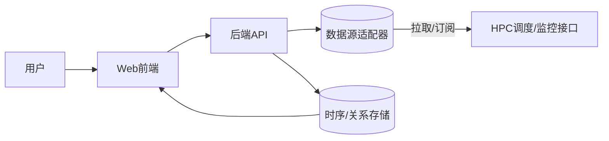
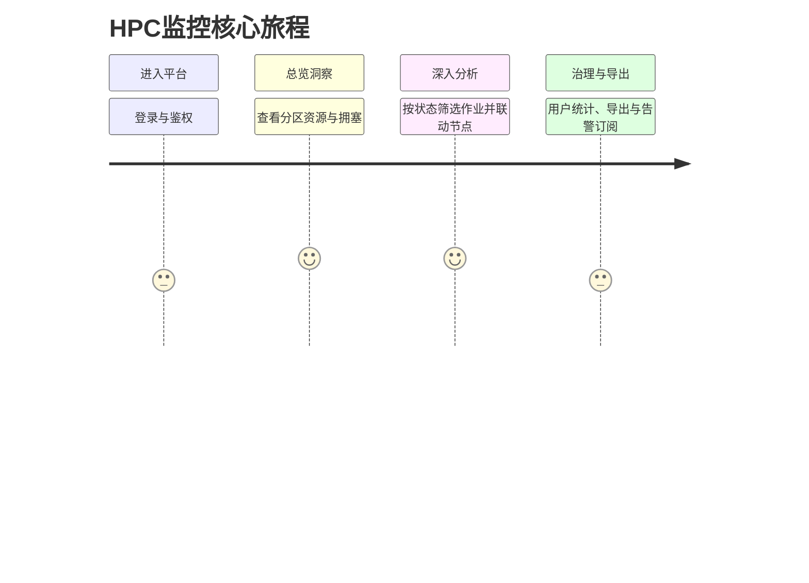
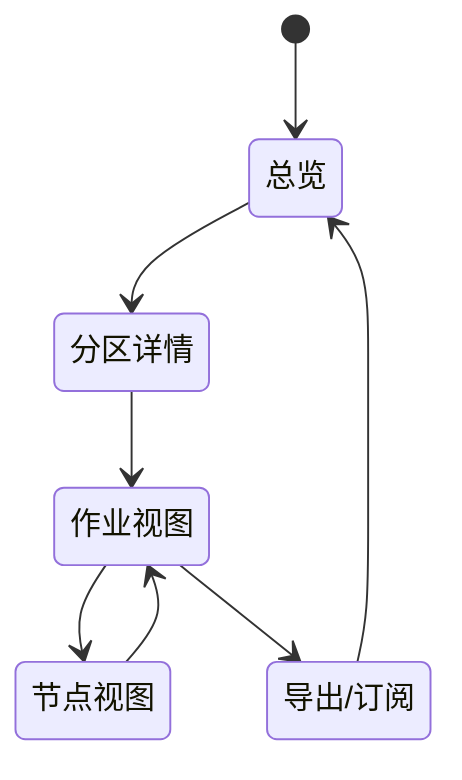

# 目录
- 1. 文档信息
  - 1.1 版本历史
  - 1.2 文档目的
  - 1.3 相关文档引用
- 2. 产品概述
  - 2.1 产品名称与定位
  - 2.2 产品愿景与使命
  - 2.3 价值主张与独特卖点（USP）
  - 2.4 目标平台列表
  - 2.5 产品核心假设
  - 2.6 商业模式概述
- 3. 用户研究
  - 3.1 目标用户画像
  - 3.2 用户场景分析
  - 3.3 用户调研洞察
- 4. 市场与竞品分析
  - 4.1 市场规模与增长预测
  - 4.2 行业趋势分析
  - 4.3 竞争格局分析
  - 4.4 竞品功能对比矩阵
  - 4.5 市场差异化策略
- 5. 产品功能需求
  - 5.1 功能架构与模块划分
  - 5.2 核心功能详述
  - 5.3 次要功能描述
  - 5.4 未来功能储备（Backlog）
- 6. 用户流程与交互设计指导
  - 6.1 核心用户旅程地图
  - 6.2 关键流程详述与状态转换图
  - 6.3 对设计师的界面原型参考说明
  - 6.4 交互设计规范与原则建议
- 7. 非功能需求
  - 7.1 性能需求
  - 7.2 安全需求
  - 7.3 可用性与可访问性标准
  - 7.4 合规性要求
  - 7.5 数据统计与分析需求
- 8. 技术架构考量
  - 8.1 技术栈建议
  - 8.2 系统集成需求
  - 8.3 技术依赖与约束
  - 8.4 数据模型建议
- 9. 验收标准汇总
  - 9.1 功能验收标准矩阵
  - 9.2 性能验收标准
  - 9.3 质量验收标准
- 10. 产品成功指标
  - 10.1 关键绩效指标（KPIs）
  - 10.2 北极星指标
  - 10.3 指标监测计划

## 1. 文档信息

### 1.1 版本历史

| 版本 | 日期 | 作者 | 说明 |
|---|---|---|---|
| v1.0.0 | 2026-01-07 | PM | 基于初版需求说明生成完整PRD |

### 1.2 文档目的
- 明确华为HPC资源监控平台（Web端）的目标、范围、功能、非功能需求与验收标准。
- 为设计、前后端开发与测试提供统一的需求依据与执行指南。

### 1.3 相关文档引用
- 初始需求说明（输入来源）：[需求说明.txt](file:///d:/work/hpc/需求说明.txt)

## 2. 产品概述

### 2.1 产品名称与定位
- 名称：华为HPC资源监控平台（Web端）
- 定位：面向集群管理员与科研用户的实时可视化监控与运维效率平台。

### 2.2 产品愿景与使命
- 愿景：让复杂的HPC资源状态“一屏掌控”，支撑高效、透明的算力调度。
- 使命：提供分区、作业、节点与用户维度的统一数据视图与分析能力。

### 2.3 价值主张与独特卖点（USP）
- 单屏分区资源总览与剩余容量洞察，支持快速决策与调度。
- 作业/节点双视图联动，定位性能瓶颈与排队拥塞根因。
- 用户在线与角色统计，支持配额治理与使用行为分析。

### 2.4 目标平台列表
- Web（桌面浏览器，Chrome/Edge/Firefox 最新两个大版本）
- 后端API（供Web前端调用）

### 2.5 产品核心假设
- 已可获取数据源：
  - 分区资源实时数据（总/剩余：CPU核数、内存、GPU）
  - 分区关联作业列表（状态、申请的CPU/内存/GPU、开始/结束时间、申请人、所属节点）
  - 分区关联节点列表（总/剩余：CPU/内存/GPU）
  - 平台用户数据（用户名、昵称、角色；总用户数、在线用户数）
- 数据更新频率满足近实时（例如5–15秒），具体频率待技术方案确认。

### 2.6 商业模式概述
- 场景定位为企业/研究机构内部运维平台；不直接对外销售；后续可扩展至多租户收费版（待定）。

## 3. 用户研究

### 3.1 目标用户画像

| 角色 | 目标 | 痛点 | 关键需求 |
|---|---|---|---|
| 集群管理员 | 维护稳定性与利用率 | 数据分散、缺乏整体视图 | 分区总览、告警、瓶颈定位、容量趋势 |
| 资深科研用户 | 提升作业吞吐与效率 | 排队不透明、资源匹配难 | 作业状态可视、剩余资源匹配、节点健康 |
| 研发/经理 | 资源治理与成本控制 | 难以衡量人/部门使用情况 | 用户统计、角色权限、使用率与热点分析 |

### 3.2 用户场景分析
- 场景1：分区容量监控与排队拥塞识别
- 场景2：作业运行状态排查与节点资源对比
- 场景3：节点健康巡检与异常节点下线建议
- 场景4：用户在线与角色分布统计，用于权限治理与容量规划

### 3.3 用户调研洞察（如适用）
- HPC环境常见痛点为资源碎片化与排队拥塞；需提供直观的剩余容量与作业排队结构。

## 4. 市场与竞品分析

### 4.1 市场规模与增长预测
- 企业与高校/研究院对HPC依赖增长，内部监控平台为标配；市场稳健增长（定性结论）。

### 4.2 行业趋势分析
- 从纯监控向“监控+调度优化建议”演进；从静态面板向近实时态势与异常检测演进。

### 4.3 竞争格局分析
- 直接竞品：各类集群监控面板（如部分厂商定制版）、Slurm Web前端等。
- 间接竞品：Grafana/Prometheus通用监控，需要大量定制才能满足HPC维度。

### 4.4 竞品功能对比矩阵（示例）

| 功能 | 本产品 | 通用监控 | Slurm Web前端 |
|---|---|---|---|
| 分区总览（总/剩余CPU/内存/GPU） | ✓ | △（需定制） | △ |
| 作业列表（状态、资源、时间、节点） | ✓ | △ | ✓ |
| 节点列表（总/剩余资源） | ✓ | △ | ✓ |
| 用户统计（在线、角色） | ✓ | △ | ✗ |
| 联动分析（作业↔节点↔分区） | ✓ | ✗ | △ |

### 4.5 市场差异化策略
- 针对HPC语义与工作流优化的专用视图与联动分析；减少通用监控的高定制成本。

## 5. 产品功能需求

### 5.1 功能架构与模块划分

- 模块：分区资源看板、作业管理视图、节点资源视图、用户统计与权限、搜索筛选与导出、告警与订阅。

### 5.2 核心功能详述

#### 5.2.1 分区资源看板
- 用户故事：作为集群管理员，我想查看各分区总/剩余CPU、内存、GPU，以便快速判断容量与拥塞。
- 用户价值：快速场景洞察、减少排队投诉与盲目扩容。
- 功能逻辑与规则：
  - 展示每个分区：总资源与剩余资源（CPU核数、内存、GPU数）。
  - 支持近实时刷新（默认10秒，可配置）。
  - 支持分区排序（剩余容量、利用率、队列长度）。
- 交互要求：图表+表格，卡片化展示；分区点击进入详情联动作业与节点。
- 数据需求：分区ID、总/剩余CPU、总/剩余内存、总/剩余GPU、更新时间戳。
- 技术依赖：HPC接口/调度系统（如Slurm等）的分区资源API或导出数据。
- 验收标准：
  - 正确展示所有分区且数据延迟≤15秒；
  - 排序与刷新行为正确；
  - 数据异常时有降级提示。

#### 5.2.2 作业管理视图
- 用户故事：作为科研用户，我希望按状态查看作业并匹配剩余资源，以便调整提交策略。
- 用户价值：透明排队、优化资源申请、减少失败重试。
- 功能逻辑与规则：
  - 列表字段：状态（运行/排队/取消/完成/失败）、申请的CPU/内存/GPU、开始/结束时间（结束为空表示无限长）、申请人、所属节点。
  - 支持状态筛选、用户筛选、时间区间筛选、资源需求筛选。
  - 支持与节点视图联动：选中作业显示其节点的资源情况。
- 交互要求：表格视图、可展开查看作业详情；批量筛选与快速搜索。
- 数据需求：作业ID、状态、资源申请、时间、用户、节点、所属分区。
- 技术依赖：调度系统作业查询接口。
- 验收标准：
  - 列表渲染正确、筛选与联动无误；
  - 运行中作业与排队作业统计一致；
  - 空结束时间处理正确显示“无限时长”。

#### 5.2.3 节点资源视图
- 用户故事：作为管理员，我要查看节点总/剩余资源，定位热点与异常节点。
- 用户价值：提升稳定性、避免资源碎片化。
- 功能逻辑与规则：
  - 列表字段：总/剩余CPU、内存、GPU；节点状态（健康、告警、离线）。
  - 支持节点分区筛选、按剩余资源排序、健康状态过滤。
  - 与作业联动：显示占用该节点的作业集合。
- 交互要求：可视化剩余条形图；节点详情抽屉。
- 数据需求：节点ID、分区、总/剩余资源、健康状态。
- 技术依赖：节点监控与资产接口。
- 验收标准：
  - 节点总/剩余与分区汇总一致性校验通过；
  - 健康状态展示与阈值规则匹配。

#### 5.2.4 用户与在线统计
- 用户故事：作为经理，我想了解总用户数、在线用户数与角色分布，以便权限治理与容量规划。
- 用户价值：资源治理透明化、改善使用体验。
- 功能逻辑与规则：
  - 展示总用户数、在线用户数、按角色统计（管理员/普通用户/访客等）。
  - 在线定义：最近N分钟内有交互/心跳（N可配置）。
- 交互要求：趋势图+分布饼图；支持时间窗口切换。
- 数据需求：用户名、昵称、角色、在线状态、最近活跃时间。
- 技术依赖：用户中心/认证系统与会话心跳。
- 验收标准：统计口径在PRD定义一致，刷新与时间窗口切换正确。

### 5.3 次要功能描述
- 搜索与筛选（作业、节点、分区、用户）
- 导出（CSV/JSON）
- 告警订阅（邮件/IM，阈值策略）
- 权限控制（按角色隐藏/显示模块）

### 5.4 未来功能储备（Backlog）
- 容量趋势预测与自动化建议（智能调度提示）
- 异常检测（GPU/内存泄漏、节点波动）
- 多租户与配额管理
- 移动端轻量看板（待评估）

## 6. 用户流程与交互设计指导

### 6.1 核心用户旅程地图

### 6.2 关键流程详述与状态转换图

### 6.3 对设计师的界面原型参考说明
- 信息层级：分区→作业/节点→用户统计的三级结构；保持一屏内主要指标可见。
- 视觉：利用率与剩余资源采用一致色系（例如绿色充足、橙色紧张、红色告警）。
- 交互：筛选控件常驻顶栏；详情侧抽屉不遮挡主列表；联动高亮。

### 6.4 交互设计规范与原则建议
- 一致性、可发现性、反馈明确、错误可恢复；支持键盘导航与基础无障碍。

## 7. 非功能需求

### 7.1 性能需求
- 页面首屏渲染≤2秒（缓存命中场景）；交互响应≤300ms；数据延迟≤15秒。

### 7.2 安全需求
- 鉴权与授权（RBAC）；接口签名与速率限制；审计日志。

### 7.3 可用性与可访问性标准
- 支持WCAG 2.1 AA基础要求（对比度、键盘可用等）。

### 7.4 合规性要求
- 企业内部数据合规；日志与隐私保护按公司规范执行。

### 7.5 数据统计与分析需求
- 埋点事件：分区卡片点击、筛选变更、作业详情展开、导出、告警订阅点击、登录成功。
- 指标：活跃用户数、功能点击率、视图停留时长、筛选组合使用频次。

## 8. 技术架构考量

### 8.1 技术栈建议（供参考）
- 前端：现代Web框架（React或Vue），ECharts/Chart.js用于可视化。
- 后端：Go/Java 微服务；接口聚合与缓存层（Redis）。
- 存储：时序/关系型结合（如 PostgreSQL + 时序扩展），按需落库。

### 8.2 系统集成需求
- 对接HPC调度/监控接口（如Slurm、华为内部接口），支持拉取与订阅两种模式。

### 8.3 技术依赖与约束
- 近实时更新频率取决于数据源能力；部分指标可能仅支持周期采样。

### 8.4 数据模型建议（关键实体）

| 实体 | 主键 | 关键字段 |
|---|---|---|
| Partition | partition_id | name, total_cpu, total_mem, total_gpu, free_cpu, free_mem, free_gpu, updated_at |
| Job | job_id | status, req_cpu, req_mem, req_gpu, start_time, end_time, user_id, node_id, partition_id |
| Node | node_id | partition_id, total_cpu, total_mem, total_gpu, free_cpu, free_mem, free_gpu, health_status |
| User | user_id | username, nickname, role, online, last_active_at |

## 9. 验收标准汇总

### 9.1 功能验收标准矩阵

| 功能 | 验收点 |
|---|---|
| 分区看板 | 全分区展示、数据延迟≤15秒、排序正确、异常提示 |
| 作业视图 | 列表字段完整、筛选正确、与节点联动正确、无限时长显示正确 |
| 节点视图 | 总/剩余一致性校验通过、健康状态显示与规则匹配 |
| 用户统计 | 总/在线/角色统计口径一致、时间窗口切换正确 |

### 9.2 性能验收标准
- 首屏≤2秒、交互≤300ms、数据延迟≤15秒（在测试环境达到）。

### 9.3 质量验收标准
- 关键功能零阻塞缺陷；UI与交互符合规范；基础埋点上线并验证。

## 10. 产品成功指标

### 10.1 关键绩效指标（KPIs）
- 平台日活/周活、活跃用户占比、主要视图使用率、平均会话时长。
- 监控数据延迟（P95）、页面加载时间（P95）。

### 10.2 北极星指标
- 集群管理员与科研用户的“问题定位时间”缩短比例（如同比下降≥30%）。

### 10.3 指标监测计划
- 前端埋点与后端日志聚合；周报与月报输出；异常波动自动告警。

— 以上PRD基于初始数据能力与行业最佳实践生成，细化口径与刷新频率需在技术方案评审时确认并回填至本文档。 —

