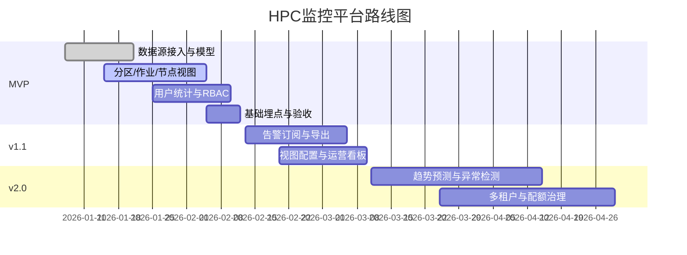

# 目录
- 1. 路线图概述
- 2. 版本规划策略
- 3. 详细版本规划（MVP / v1.1 / v2.0）
- 4. 功能优先级矩阵（P0/P1/P2）
- 5. 详细时间线计划（里程碑）
- 6. 资源规划（初步建议）
- 7. 风险管理

## 1. 路线图概述
- 目标：构建集群管理员与科研用户的一屏式实时监控与联动分析平台。
- 范围：分区资源总览、作业视图、节点视图、用户统计；搜索筛选与导出；告警与订阅；RBAC权限。

## 2. 版本规划策略
- 优先保障近实时数据与核心视图连通性，采用迭代增强策略。
- MVP聚焦看见与筛选，后续逐步引入告警、治理与智能建议。

## 3. 详细版本规划

### MVP（P0）
- 分区资源看板（总/剩余CPU、内存、GPU；近实时刷新）。
- 作业管理视图（状态、资源、时间、用户、节点；筛选与联动）。
- 节点资源视图（总/剩余、健康状态；与作业联动）。
- 用户统计（总用户数、在线用户数、角色分布）。
- 基础搜索与筛选；基础RBAC（查看权限）。

### v1.1（P1）
- 告警订阅（邮件/IM；阈值策略，分区/节点利用率、队列拥塞）。
- 数据导出（CSV/JSON）；视图配置持久化（刷新间隔、列显示）。
- 埋点统计与运营看板（DAU、使用率、点击路径）。

### v2.0（P2）
- 容量趋势预测与建议（CPU/GPU热点、排队拥塞趋势）。
- 异常检测（节点波动、内存泄漏、GPU异常）。
- 多租户与配额治理；更细粒度RBAC。

## 4. 功能优先级矩阵

| 模块 | 功能 | 优先级 |
|---|---|---|
| 分区看板 | 总/剩余资源展示、排序与刷新 | P0 |
| 作业视图 | 状态/资源/时间/用户/节点 + 筛选 | P0 |
| 节点视图 | 总/剩余、健康状态、联动 | P0 |
| 用户统计 | 总/在线/角色分布 | P0 |
| 搜索筛选 | 全局与局部筛选 | P0 |
| 导出 | CSV/JSON导出 | P1 |
| 告警订阅 | 阈值策略与通知 | P1 |
| 视图配置 | 刷新间隔与列配置 | P1 |
| 趋势预测 | 容量与拥塞预测 | P2 |
| 异常检测 | 节点与资源异常 | P2 |
| 多租户 | 配额与治理 | P2 |

## 5. 详细时间线计划（里程碑）

## 6. 资源规划（初步建议）
- 人员：前端2、后端2、QA1、PM/设计各1；数据适配器与运维各1（兼职）。
- 环境：测试/预生产/生产三套；监控与日志聚合。

## 7. 风险管理
- 数据源不稳定或延迟过高：设定降级策略与缓存；明确SLA口径。
- 指标一致性与口径对齐：建立对账任务与一致性校验。
- 可视化性能与交互负载：采用虚拟列表与增量刷新；前端性能预算。
- 权限与合规：完善RBAC、审计日志与访问控制策略。
