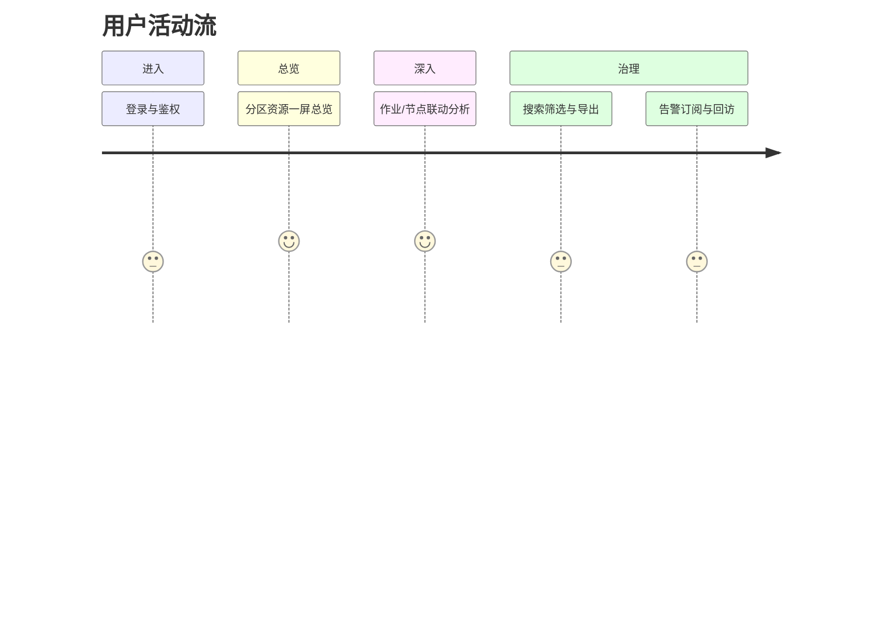

# 目录
- 1. 用户故事地图概述
- 2. 用户活动流（横向）
- 3. 用户任务分解（纵向）
- 4. 故事优先级与版本映射

## 1. 用户故事地图概述
- 聚焦看见筛选联动治理的核心体验路径，提升问题定位效率。

## 2. 用户活动流（横向）
- 进入平台  查看分区总览  深入作业/节点  搜索与筛选  导出/订阅  回到总览。

## 3. 用户任务分解（纵向）

| 活动 | 任务 | 故事（用户类型/目标/价值） |
|---|---|---|
| 查看分区 | 浏览卡片、排序、刷新 | 作为管理员，我要按剩余容量排序，以便快速定位拥塞分区。 |
| 作业分析 | 按状态/用户筛选、查看详情 | 作为用户，我要查看排队作业与匹配资源，以便调整提交策略。 |
| 节点分析 | 剩余资源对比、健康状态 | 作为管理员，我要识别异常节点，以便及时下线或维护。 |
| 用户统计 | 在线与角色分布 | 作为经理，我要了解角色分布，以便治理权限与容量规划。 |
| 搜索筛选 | 多维筛选与组合查询 | 作为用户，我要快速定位目标作业与节点，以节省时间。 |
| 导出/订阅 | 导出报表、订阅告警 | 作为管理员，我要订阅阈值告警，以便及时处置。 |

## 4. 故事优先级与版本映射

| 故事 | MVP | v1.1 | v2.0 |
|---|---|---|---|
| 分区总览排序与刷新 |  |  |  |
| 作业状态筛选与详情 |  |  |  |
| 节点健康状态与联动 |  |  |  |
| 用户在线与角色分布 |  |  |  |
| 全局搜索与组合筛选 |  |  |  |
| 导出（CSV/JSON） |  |  |  |
| 告警订阅（阈值） |  |  |  |
| 趋势预测与异常检测 |  |  |  |
| 多租户与配额治理 |  |  |  |
