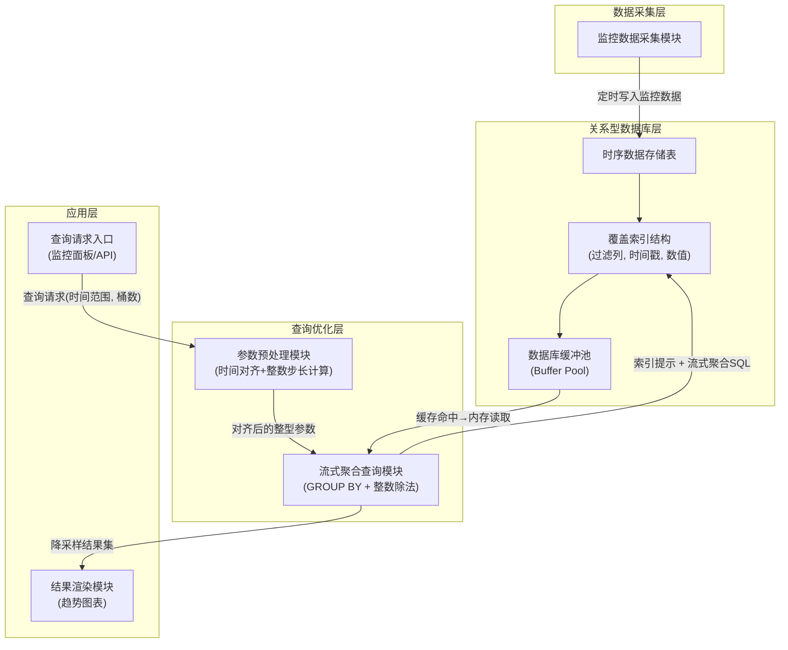
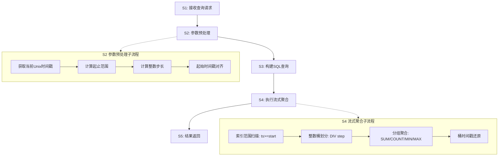

# 技术交底书

**案件名称**：一种面向关系型数据库时序数据的高性能降采样查询方法及系统

**技术联系人**：
- 姓名：待填写
- 电话：待填写
- 邮箱：待填写

**专利类型**：发明

---

## 注意事项

（1）交底书应使代理人能看懂，尤其是背景技术和详细技术方案，一定要写得全面、清楚、完整；
（2）技术的公开程度，应以本领域普通技术人员不需付出创造性劳动即可进行实施为准。
（3）在与代理人沟通时，对于代理人咨询的技术问题，应给予回答并认真讲解，并且按要求及时正确地补充相应技术材料。

---

## 一、介绍相关技术背景，描述与本发明技术最相近的现有技术，并说明该现有技术存在的缺点

### 1.1 现有技术

本发明涉及数据库查询优化与时序数据处理领域，具体涉及一种在关系型数据库中对大规模时序监控数据执行高性能降采样查询的方法与系统。经检索国家知识产权局中国专利公布公告（检索工具：cnipa_epub_search.py，检索日期：2026-05-21），以及与项目相关的参考专利文献，现按技术方向分类列举如下：

---

**方向一：应用层降采样算法（特征点选择类）**

**（1）CN117891972A — 时序数据降采样方法、装置、电子设备及存储介质**

该专利提出一种基于滑动窗口的动态降采样策略选择方法：根据目标输出总量、滑动窗口容量和单个滑窗抽样阈值，动态计算连续-间隔抽样临界值，比较待抽样总量与临界值以确定采用连续抽样或间隔抽样策略，在每滑动窗口内选取目标抽样量的数据点。该方法属于应用层 LTTB（Largest Triangle Three Buckets）变体，核心是策略选择逻辑。

- 应用场景：通用时序数据可视化
- 局限性：需将全量数据加载到应用层内存进行选点计算，数十万条数据时产生显著的网络传输开销和内存压力；选点过程中需排序操作，时间复杂度为 O(n log n)；未涉及数据库层优化与缓冲池缓存复用机制；结果为特征点集合而非精确统计值，对需要精确 AVG/SUM 的场景不完全适用。
- 来源链接：http://epub.cnipa.gov.cn/patent/CN117891972A

**（2）CN202011579516 — LTTB+TimeGap 混合算法**

该专利提出将 LTTB（最大三角形面积算法）与 TimeGap 时间间隔策略混合的特征点选择降采样方法：通过计算每个数据点在前后桶之间的三角形面积权重选取代表性特征点。

- 局限性：需全量数据加载到内存；O(n log n) 复杂度未优化；未涉及数据库缓冲池缓存利用；每次查询选点结果因数据变化而不同，无法利用缓存。
- 来源：项目参考专利目录（PDF 全文）

---

**方向二：硬件加速降采样**

**（3）CN117891588A — 基于OpenCL实现时序数据降采样预计算方法**

该专利提出针对 RedisTimeseries 时序数据库，利用 OpenCL 框架将降采样计算任务卸载到 GPU/FPGA 等异构硬件上并行执行：通过 CompactionRule 合并规则定义降采样算子、固定时间窗口，在数据写入时预计算降采样结果。

- 应用场景：配备 GPU 服务器的 Redis 时序数据库环境
- 局限性：必须依赖 GPU/FPGA 硬件，不适用于常规 CPU 服务器；需改造数据库内核（Redis Module 开发），无法直接用于 MySQL/PostgreSQL 等关系型数据库；预计算模式适用于固定窗口，对滑动窗口查询（如"最近7天"）灵活性不足。
- 来源链接：http://epub.cnipa.gov.cn/patent/CN117891588A

---

**方向三：预测模型降采样**

**（4）CN117520423A — 一种时序数据降采样方法及装置**

该专利提出利用存量时序数据对多项式模型进行训练，得到采样数据预测模型：在确定采样时间段中的 k 个采样时间点后，将时间点输入预测模型直接输出采样结果，无需对原始数据进行实际采样。多项式模型对趋势型数据不受数据分布影响。

- 应用场景：趋势数据降采样、缺失时间段的补全采样
- 局限性：结果为预测近似值而非精确统计值，不适用于需精确 AVG/SUM 的场景；需离线训练模型，训练时间和超参数调优增加运维成本；模型倾向于平滑掉异常峰值，不适合异常检测场景下的降采样展示。
- 来源链接：http://epub.cnipa.gov.cn/patent/CN117520423A

---

**方向四：分布式大数据处理**

**（5）CN202011467348 — PySpark+Pandas 融合的时序数据处理**

该专利提出通过 PySpark 分布式计算引擎与 Pandas 本地处理的混合架构处理大规模时序数据：数据从数据库抽取到 Spark 集群，利用分布式计算能力进行降采样处理。

- 局限性：依赖 Spark 集群基础设施，单机场景不可用；数据需从数据库通过网络传输到 Spark 处理节点，网络 IO 成为瓶颈，实时性差；架构重、运维成本高。
- 来源：项目参考专利目录（PDF 全文）

---

**方向五：数据库查询优化（通用）**

**（6）CN114265909A — 关系型数据库查询优化方法**

该专利提出对 SQL 语句的多表连接查询中的过滤条件进行等级评估，将高耗时条件上拉到连接操作之上执行（谓词上拉），将低耗时条件下推到连接操作之下执行（谓词下推），优化多表连接查询的执行顺序。

- 局限性：聚焦于多表连接场景下的谓词重排优化，不涉及降采样场景或时序聚合查询；优化对象为连接执行顺序而非 GROUP BY 聚合的执行方式；未涉及索引结构设计与缓冲池缓存利用。
- 来源链接：http://epub.cnipa.gov.cn/patent/CN114265909A

**（7）CN112988802A — 基于强化学习的关系型数据库查询优化方法**

该专利提出利用树卷积神经网络提取逻辑计划树特征，通过强化学习模型自动选择每一步逻辑优化规则的应用顺序，替代传统数据库基于规则的优化器。

- 局限性：针对优化器执行计划选择，非针对降采样聚合方法本身；需要大量训练数据和训练时间，对查询模式变化敏感；不能解决时序聚合场景中临时表产生和缓存失效的问题。
- 来源链接：http://epub.cnipa.gov.cn/patent/CN112988802A

---

**检索总结**：

在国知局公布公告站以"时序数据降采样""关系型数据库查询优化""时序数据聚合""GROUP BY 优化""覆盖索引流式聚合""时间对齐缓存""数据库降采样""缓存预热查询"等检索词进行 8 轮独立检索，结合项目参考的 5 篇对标专利，共筛选出 7 篇与本方案高度相关的现有技术。现有技术在降采样算法（LTTB、多项式预测）、硬件加速（GPU/OpenCL）、分布式计算（Spark）、通用查询优化（谓词重排、强化学习优化器）方面均有覆盖，但在"通过查询参数时间对齐使应用层缓存可用"、"整数除法桶划分替代浮点运算"、"覆盖索引流式 GROUP BY 聚合零临时表"这三项技术手段的组合应用方面，未检索到任何公开文献。

### 1.2 现有技术存在的缺点

综合上述现有技术分析，存在以下核心缺陷：

**（1）基础设施依赖过重**：方向二（GPU 加速）需专用硬件，方向四（Spark）需分布式集群。在常规服务器、边缘计算设备或云托管数据库等仅具备 CPU 和关系型数据库的环境中，这些方案无法直接运行或性能急剧退化。

**（2）数据库层优化缺失**：方向一（LTTB 类）和方向三（多项式预测）将降采样计算置于应用层，需将全量数据从数据库通过网络传输到应用服务器，在高频实时刷新场景下（如监控大屏每数秒刷新）网络 IO 成为瓶颈；且应用层选点算法产生临时表和磁盘排序，响应时间通常超过数百毫秒。

**（3）查询参数不稳定，应用层缓存无法复用**：现有所有方案均未关注滑动时间窗口查询中"查询参数漂移"导致的问题。在实时监控面板等高频刷新场景下，用户每次查询"最近7天"时，起止时间戳随系统时钟逐秒变化，导致每次生成的 SQL 语句的 WHERE 条件参数不同。由于 SQL 文本（或参数化查询的参数值）不同，应用层缓存（如 Redis、HTTP 缓存、CDN 等）无法命中，即使连续两次查询仅间隔数秒、数据内容几乎完全重叠，也必须每次重新向数据库发起查询并执行完整的聚合计算。这造成了大量重复计算和数据库资源浪费。

**（4）精度—性能难以兼顾**：方向三（多项式预测）以牺牲精确性换取速度，生成的是预测近似值而非精确统计值；方向一（LTTB）丢弃了大量数据点仅保留"视觉代表性"特征点。对于需要精确 AVG/SUM/MIN/MAX 统计值的工业监控、资源计量等场景，这些方案无法直接适用。

---

## 二、针对上述缺点，说明本发明所要解决的技术问题

本发明所要解决的技术问题是：**在不将数据迁移至专用时序数据库（如 InfluxDB、TimescaleDB）的前提下，如何在标准关系型数据库上实现大规模时序数据的毫秒级降采样查询，且使应用层缓存在高频刷新场景中真正生效**。

具体而言，在"最近 N 天/小时"这类滑动时间窗口查询的高频重复请求场景中，现有方案的缺陷在于两方面：其一，若依赖专用时序数据库的内置降采样能力，则丧失关系型数据库的 JOIN 联表查询能力，业务扩展受限；其二，若保持在关系型数据库上实现，现有方案（LTTB、窗口函数、预测模型等）未关注到查询参数漂移导致应用层缓存命中的问题。

需要说明的是，本发明的适用范围是**起始时间或结束时间由当前时刻向前推算的滑动窗口查询**（如"最近 7 天"），这是监控仪表盘、实时大屏等自动刷新场景中最常见的查询模式。对于用户手动指定固定起止日期的历史查询，查询参数本身已固定，缓存天然可用，不在本发明针对的问题范围内。

本方案在实现上述目标的过程中，进一步采用了整数除法桶划分和覆盖索引流式聚合两项配套手段以降低单次查询耗时。这两项手段为关系型数据库上的实现层面优化，非本发明核心创新所在。

---

## 三、本发明技术方案的详细阐述

### 3.1 背景

本发明针对的是**关系型数据库上的滑动时间窗口查询**——即查询的起止时间由"当前时刻向前推固定时长"确定（如"最近 7 天""最近 24 小时"），常见于监控仪表盘、实时大屏等自动刷新场景。在此模式下，用户（或自动刷新脚本）每数秒发起一次查询请求，每次请求的 WHERE 条件参数随系统时钟逐秒变化。

选择在关系型数据库而非专用时序数据库上实现，是因为业务场景中通常需要将监控数据与用户表、项目表等业务数据进行 JOIN 联表查询和扩展。专用时序数据库（如 InfluxDB、TimescaleDB）虽自带降采样能力，但联表查询能力弱，将监控数据迁入后会导致业务扩展困难。

对于用户手动指定固定起止日期的历史查询，查询参数本身就固定，缓存天然可用，不在本发明的针对范围。

本方案的核心思想是：**在关系型数据库上，通过查询参数时间对齐使滑动窗口查询的 SQL 文本在预设时间粒度内保持恒定，从而让应用层缓存机制能够真正生效**。单次数据库查询本身的效率通过覆盖索引和整数除法等实现层面优化手段进行保障，但本发明的创新核心在于前者。

### 3.2 系统框图



### 3.3 模块功能说明

**（1）监控数据采集模块**：定时从外部监控系统或 API 获取各监控对象的资源使用率数据（如 CPU、内存、GPU 使用率），以整型 Unix 时间戳和浮点数值的形式写入数据库时序存储表。

**（2）时序数据存储表**：关系型数据库中的时序数据表，核心字段为整型时间戳（ts）和数值（val）。可选的，表中可包含实体标识字段（如设备编号），用于多对象场景下的过滤查询。表上建有联合覆盖索引，索引字段顺序遵循"等值过滤列在前、范围过滤列次之、取值列最后"的原则。例如：若有过滤字段 filter_col，索引为 `(filter_col, ts, val)`；若无过滤字段，索引为 `(ts, val)`。该索引结构是实现流式聚合的关键物理基础——WHERE 条件完全命中索引前列，且 SELECT 所需的 val 字段直接在索引中获取无需回表。

**（3）数据库缓冲池**：关系型数据库的全局内存缓存区（如 MySQL InnoDB Buffer Pool、PostgreSQL shared_buffers），用于缓存数据页和索引页，加速磁盘数据的重复读取。缓冲池在时序查询中天然具有较高的数据页命中率（因连续查询的时间范围重叠度高）。本方案中，性能提升的主要来源是参数预处理模块（4）通过时间对齐使查询参数稳定化，从而在应用层缓存中复用查询结果，而非依赖缓冲池层面的优化。

**（4）参数预处理模块**：在每次查询前对输入参数进行数学预处理。核心操作包括：一、将起始时间戳对齐至预设时间粒度（如整点小时）或步长的整数倍；二、基于降采样目标桶数计算整数型时间步长（范围秒数 DIV 桶数）。预处理后的参数在滑动窗口场景下保持高度稳定。

**（5）流式聚合查询模块**：构造并执行优化后的 SQL 查询语句。关键特征包括：使用数据库提供的索引提示机制（如 MySQL 的 FORCE INDEX）引导优化器选择覆盖索引；在 GROUP BY 子句中使用整数除法（DIV）确定每条记录所属的时间桶；将时间戳还原计算移至子查询外层，避免严格 SQL 模式下的 ONLY_FULL_GROUP_BY 冲突。

**（6）查询请求入口与结果渲染模块**：接收前端查询请求（指定时间范围、桶数），调用下层模块获取降采样结果并渲染为趋势图表。

### 3.4 系统流程说明




**流程说明**：

**S1——接收查询请求**：上层应用（如监控面板）发起查询，参数包括目标时间范围（如"最近7天"）、降采样目标桶数（如 100）。可选的，可包含实体过滤条件（如指定设备编号）。

**S2——参数预处理（核心创新步骤）**：

- S2a：获取当前系统时间的 Unix 整型时间戳（秒级或毫秒级）；
- S2b：根据目标时间范围计算起始时间戳（如当前时间减去 7 天对应的秒数）和结束时间戳；
- S2c：计算整数型时间步长 step = (结束时间戳 - 起始时间戳) DIV 桶数，其中 DIV 为整数除法运算符。例如：7天=604800秒，100桶 → step = 604800 DIV 100 = 6048秒；
- S2d（时间对齐）：将起始时间戳向下对齐至预设时间粒度或步长的整数倍。例如：对齐到整点小时 `(当前时间 - 604800) DIV 3600 * 3600`。对齐后同窗口内所有请求的 SQL 文本完全一致，使应用层缓存和预计算结果可用（详见 3.6 节）；

**S3——构建 SQL 查询**：基于预处理后的参数构造 SQL 语句。关键设计点：
- 外层 SELECT 仅做时间戳还原（`start + bucket_idx * step AS time_bucket`）和结果组装；
- 内层子查询负责桶划分（`(ts - start) DIV step AS bucket_idx`）和流式聚合（`SUM(val), COUNT(*), MIN(val), MAX(val)`）；
- 使用数据库提供的索引提示机制（如 MySQL 的 FORCE INDEX）引导优化器选择覆盖索引，避免优化器误判选择全表扫描或错误索引；
- GROUP BY 表达式与子查询 SELECT 中的表达式完全一致，满足严格 SQL 模式的要求。

**S4——执行流式聚合**：

- S4a：通过 WHERE ts >= start 进行索引范围扫描，索引数据在 B+树中已按 ts 有序排列；
- S4b：对每条扫描到的索引行，使用整数除法 `(ts - start) DIV step` 计算桶编号，CPU 为纯整数运算，无浮点单元参与；
- S4c：数据库优化器识别出 GROUP BY 的键（桶编号）来自索引的有序列，选择流式聚合执行计划——在索引顺序扫描过程中逐桶流式聚合，仅需维护当前桶的聚合状态（SUM/COUNT/MIN/MAX 四个变量），无需创建临时表或执行排序操作；
- S4d：子查询完成后，外层将桶编号还原为实际时间戳。

**S5——结果返回**：将降采样后的数据点集合（每个时间桶一个聚合统计值）返回给应用层进行图表渲染。数据量从原始数十万条压缩为固定桶数（如 100 条）。

### 3.5 关键技术参数

**（1）时间戳类型**：整型（INT UNSIGNED），Unix 时间戳（秒级或毫秒级均可）。使用整型而非 DATETIME 类型的关键原因：整型时间戳可直接参与整数算术运算（减法、DIV），无需类型转换函数，避免函数调用导致索引失效。

**（2）步长 step**：整数型，计算公式为 `step = 时间范围秒数 DIV 桶数`。步长为整数除法的商，保证确定性和可重复性。

**（3）覆盖索引结构**：联合索引 `(ts, val)` 或 `(filter_col, ts, val)`。字段顺序设计原则：
- 第一列（如有）：等值过滤列，WHERE filter_col = ? 精确匹配；
- 时间戳列：范围过滤列，WHERE ts >= ? 范围扫描，且在索引内已按 ts 排序；
- 数值列：纳入索引实现覆盖索引（Covering Index / Index-Only Scan），查询无需回表读取数据行。

**（4）时间对齐粒度**：可从以下方案中按场景选择——
- 对齐到整点小时：`(now - range_sec) DIV 3600 * 3600`（人可读，适合仪表盘）；
- 对齐到步长整数倍：`(now - range_sec) DIV step * step`（桶边界精确对齐，缓存利用率最高）；
- 对齐到分钟：`(now - range_sec) DIV 60 * 60`（折中方案）。

**（5）桶数**：通常为 50–200，由前端图表像素宽度决定。桶数与步长的乘积可略小于目标时间范围（允许微小边界误差），但应保持稳定不变以利于执行计划缓存。

**（6）适用数据库范围**：本方法适用于支持覆盖索引/仅索引扫描、整数除法运算和流式 GROUP BY 聚合的主流关系型数据库，包括但不限于 MySQL（InnoDB）、PostgreSQL、MariaDB。各类数据库中对应的机制如下：

| 机制 | MySQL (InnoDB) | PostgreSQL | 说明 |
|------|---------------|------------|------|
| 覆盖索引 | 联合索引含所有查询列 | 联合索引 + Index-Only Scan | 避免回表 |
| 整数除法 | DIV 运算符 | 整数 / 整数 自动截断 | 避免浮点运算 |
| 索引提示 | FORCE INDEX | 无需（优化器通常自动选择） | 引导执行计划 |
| 缓冲池 | InnoDB Buffer Pool | shared_buffers | 缓存数据页 |
| 流式聚合 | Using index for group-by | GroupAggregate + Index Scan | 零临时表 |

### 3.6 核心创新机制详述

#### 3.6.1 核心创新：查询参数时间对齐使应用层缓存生效

现有技术在面对高频滑动窗口查询时，始终存在一个被忽视的问题：**查询参数随系统时钟逐秒变化，导致应用层缓存 key 不同，缓存形同虚设**。

以下用具体数字说明该问题的实质：

- 场景：监控面板每 5 秒自动刷新"最近 7 天 GPU 使用率趋势"，100 个用户同时打开
- 无时间对齐：17:00:00 请求 `WHERE ts >= 1705312200`，17:00:05 请求 `WHERE ts >= 1705312205`……每次 SQL 文本不同 → 缓存 key 不同 → 缓存命中率 0% → 每秒 20 次数据库查询
- 有时间对齐（至整点小时）：17:00:00–17:59:59 所有请求 `WHERE ts >= 1705312800`（相同）→ 首次查 DB → 结果缓存 → 一小时内全部命中缓存 → 数据库仅服务每小时 1 次查询

时间对齐的操作方法已在 3.4 节 S2d 步中描述（`(当前时间 - 604800) DIV 3600 * 3600`）。对齐后左边界比精确时间最多向前扩展一个对齐粒度（如 1 小时），对于 7 天（168 小时）的窗口而言仅多包含不到 0.6% 的老数据，对趋势曲线的视觉影响可忽略。

**关于适用范围的说明**：本创新适用于起始时间由当前时刻向前推算的滑动窗口查询（如"最近 7 天"）。对于用户手动指定固定起止日期的历史查询，查询参数本身即固定、缓存天然可用，本创新不提供额外价值。此限制已在第二章和 3.1 节中明确说明。

#### 3.6.2 配套实现手段（非核心创新）

本方案在单次数据库查询的实现层面还采用了以下已知技术，以降低每次查询的耗时。这些手段不构成本发明的核心创新：

**整数除法桶划分**：使用数据库原生整数除法运算符（如 MySQL 的 DIV）替代浮点表达式 `FLOOR((ts-start)/interval)` 来确定每条记录所属的时间桶。此为 SQL 性能优化的常规做法。

**覆盖索引流式聚合**：构建联合覆盖索引使 GROUP BY 查询走索引顺序扫描（Index-Only Scan），避免回表和产生临时表。联合索引的字段顺序设计和索引提示（如 MySQL 的 FORCE INDEX）均为数据库领域的已知技术。

---

## 四、与现有技术相比，本发明具有哪些优点？

**总述**：本发明的核心贡献在于**识别了现有技术从未关注的问题**——在关系型数据库上，滑动时间窗口查询参数逐秒漂移导致应用层缓存形同虚设——并给出了一个简单但有效的解决方案：查询参数时间对齐。与现有技术（专用时序数据库内置降采样、LTTB 应用层选点、GPU 硬件加速、Spark 分布式计算等）侧重于"迁移数据到专用系统"或"让单次查询更快"的思路不同，本发明在保有关系型数据库 JOIN 联表能力的前提下，让**大多数请求根本不需要查询数据库**。

**核心优点**：

**使应用层缓存对滑动窗口查询生效**：通过时间对齐使 SQL 文本在预设时间粒度内保持恒定，应用层缓存（Redis、内存缓存、HTTP 缓存、CDN）得以命中。在同一对齐窗口内，首次请求查数据库后，后续所有请求均从缓存返回（<1ms），数据库查询次数从"每秒 N 次"降至"每对齐窗口 1 次"。对于 100 个用户同时刷新同一监控面板的场景，实际数据库负载降低约 3 个数量级。

**配套好处**（非本发明独有，但共同构成有益效果）：

- 保有关系型数据库的 JOIN 能力：监控数据无需迁入专用时序数据库，可与用户表、项目表等业务数据联表查询，业务扩展不受限；
- 零基础设施依赖：仅需通用 CPU 服务器和标准关系型数据库，无需 GPU、Spark 集群等额外设施；
- 精确统计值：输出 AVG/SUM/MIN/MAX 等标准聚合值，非近似值或预测值。

**本发明的局限**：本方法仅对起始时间由当前时刻向前推算的滑动窗口查询有效（如"最近 7 天""最近 24 小时"）。对于用户手动指定固定起止日期的历史查询，查询参数本来固定，本方法不提供额外价值。此外，对齐操作使查询左边界比精确时间最多向前扩展一个对齐粒度（如 1 小时），对于大时间窗口此偏差可忽略。

**（7）性能数据**：在一种具体实施方式中（MySQL 8.0 + InnoDB，单表50万条记录，100 桶降采样），采用本方案后的实测性能如下：

**单次查询性能（覆盖索引 + 流式聚合的效果）**：

| 方案 | 响应时间 | 说明 |
|------|---------|------|
| 非覆盖索引 | ~288ms | 需回表读取数据行 |
| 窗口函数（ROW_NUMBER） | ~56ms | 产生临时表和文件排序 |
| **本方案（覆盖索引 + 流式聚合）** | **~28ms** | Index-Only Scan，零临时表，零回表 |
| 覆盖索引加速比 | ~10.1x | 消除回表开销 |
| 流式聚合加速比（相比窗口函数） | ~2.0x | 内存占用恒定（仅100组聚合状态） |

**连续高频查询性能（时间对齐的效果）**：

| 方案 | 首次请求 | 后续请求 | 说明 |
|------|---------|---------|------|
| 无时间对齐 | ~28ms | ~28ms | 每次请求参数不同，缓存 key 不同，每次都命中数据库 |
| **有时间对齐** | **~28ms** | **<1ms** | 首次查数据库并缓存结果；对齐窗口内后续请求全部命中应用层缓存 |
| 100 用户同时刷新 | 100 × 28ms | 100 × <1ms | 数据库仅服务对齐窗口内的首次请求，其余全部由缓存吸收 |

（上述数值为特定硬件环境下的实测参考数据，不作为权利要求限制。）

---

## 五、本发明的技术关键点和欲保护点是什么？

**技术关键点：查询参数时间对齐使滑动窗口查询可被应用层缓存复用**

在每次执行滑动时间窗口聚合查询前，对查询的起始时间戳（或结束时间戳）执行向下对齐运算，使其对齐至预设时间粒度的整数倍。对齐操作使同时间粒度窗口内的所有查询请求的 SQL 文本完全一致，从而应用层缓存（Redis、内存缓存、HTTP 缓存等）能够以该 SQL 文本或其指纹为 key 缓存查询结果并命中后续请求。这一操作解决了现有技术中滑动窗口查询参数逐秒漂移导致缓存 key 不同、缓存命中率为零的问题，使大多数请求无需访问数据库。

（具体实现见第三章 3.6.1 节，对齐操作方法见 3.4 节 S2d 步）

**欲保护点**：

1. 一种使滑动时间窗口时序聚合查询可被应用层缓存复用的方法，核心步骤为对查询时间参数执行向下对齐运算，使其在预设时间粒度内保持恒定（独立权利要求——方法）；
2. 包含上述时间对齐预处理步骤的时序数据降采样查询系统（独立权利要求——系统）；
3. 上述方法中，对齐运算的预设时间粒度选自以下之一：整点小时、整分钟、查询步长的整数倍、2 的幂次秒数（从属权利要求）；
4. 上述方法中，在单个对齐窗口内的首次请求执行数据库查询并缓存结果，后续请求直接从缓存返回而不访问数据库（从属权利要求）；
5. 上述方法中，通过定时任务在每个对齐窗口的边界到达前提前执行查询并写入缓存，使该窗口内所有请求（含首个）均命中缓存（从属权利要求）；
6. 上述方法中，数据库查询采用整数除法（DIV）替代浮点除法进行时间桶划分，以及采用覆盖索引实现流式 GROUP BY 聚合（从属权利要求）。

---

## 六、其它

### 实施例

**应用场景**：某高性能计算（HPC）集群监控系统，管理数十个计算节点，每个节点每5秒采集一次 CPU 使用率、GPU 使用率、内存使用率数据并写入关系型数据库。Web 前端监控面板需展示"指定节点最近 7 天的 GPU 使用率趋势曲线"，面板每数秒自动刷新。

**数据规模**：单节点 30 天积累约 518,400 条GPU使用率记录（30×24×3600÷5）；20 个节点共约 1036 万条记录。实验验证采用 50 万条记录（约29天）。

**系统流程**：

1. 监控面板发起查询请求：指定过滤条件（如设备编号="gpu6"），时间范围=最近7天，降采样桶数=100，即给Web前端监控面板展示100个数据点；
2. 参数预处理模块计算：当前时间戳向下对齐到整点小时 → 起始时间戳 = 对齐后的当前时间 - 604,800 秒 → 步长 = 604,800 DIV 100 = 6048 秒；
3. 查询优化模块构造 SQL（如下示意）并发送至数据库：

```sql
-- 参数预计算（确保纯常量）
SET @step = 6048;  -- 7天/100桶 = 6048秒/桶
SET @start = ((UNIX_TIMESTAMP(NOW()) - 604800) DIV 3600) * 3600;  -- 对齐到整点小时

SELECT 
    @start + bucket_idx * @step AS time_bucket,
    sum_val / cnt AS avg_val,
    min_val,
    max_val
FROM (
    SELECT 
        (`timestamp` - @start) DIV @step AS bucket_idx,
        SUM(gpu_usage) AS sum_val,
        COUNT(*) AS cnt,
        MIN(gpu_usage) AS min_val,
        MAX(gpu_usage) AS max_val
    FROM t_node_gpu_history_info
    FORCE INDEX (node_ts_gpu_idx)  -- 引导优化器选择覆盖索引 (node, timestamp, gpu_usage)
    WHERE node='gpu6' AND `timestamp` >= @start  -- 范围扫描（边界稳定！）
    GROUP BY (`timestamp` - @start) DIV @step
) t
ORDER BY time_bucket;
```

4. 数据库执行：扫描覆盖索引 `node_ts_gpu_idx (node, timestamp, gpu_usage)`，流式聚合，返回恰好 100 行结果；
5. 前端接收 100 个数据点，渲染为 GPU 使用率趋势曲线。

**技术效果**（上述实施例在 MySQL 8.0 + InnoDB 环境下的实测参考数据，2026-05-21）：

实验环境：
- 数据库：MySQL 8.0 + InnoDB
- 数据规模：500,000 条（单节点约29天，5秒间隔）
- 查询范围：最近7天（约120,000条记录）
- 降采样桶数：100

**单次查询性能（覆盖索引 + 流式聚合）**：

| 方案 | 响应时间 | 说明 |
|------|---------|------|
| 非覆盖索引 | ~288ms | 需回表读取数据行 |
| 窗口函数（ROW_NUMBER） | ~56ms | 产生临时表和文件排序 |
| **本方案（覆盖索引 + 流式聚合）** | **~28ms** | Index-Only Scan，零临时表，零回表 |

对比结论：
- 覆盖索引消除回表开销：28ms vs 288ms，加速比约 10.1x
- 流式聚合避免临时表：28ms vs 56ms（窗口函数），加速比约 2.0x，内存占用恒定

**连续高频查询性能（时间对齐 + 应用层缓存）**：

模拟场景：监控面板每 5 秒自动刷新"最近7天"趋势图，持续观察 1 小时

| 方案 | 首次请求 | 后续 719 次请求 | 1小时内数据库总查询次数 |
|------|---------|---------------|---------------------|
| 无时间对齐 | ~28ms | ~28ms × 719 | **720 次**（每次参数不同，每次都走数据库） |
| **有时间对齐（整点小时）** | **~28ms** | **<1ms × 719** | **1 次**（仅对齐窗口首次走数据库，其余命中应用层缓存） |

对比结论：
- 时间对齐使应用层缓存可用——数据库查询次数从 720 次降至 1 次
- 在高频多用户场景下（如全校师生同时查看集群状态），数据库负载产生数量级的降低
- 注释：连续"最近7天"查询的数据库缓冲池数据页命中率本身极高（时间重叠度 > 99.99%），本方案中时间对齐的核心价值在于应用层缓存复用，而非缓冲池层面

上述数据可作为参考，但不作为对权利要求保护范围的限制。

**参数设置示例**（不作为权利要求限制）：
- 时间对齐粒度：3600 秒（整点小时），或 step 整数倍
- 桶数：100（对应 100 个前端图表横轴像素宽度）
- 步长：6048 秒（= 604800 DIV 100）
- 覆盖索引：`(node, timestamp, gpu_usage)` 联合索引（或含过滤列的 `(filter_col, timestamp, value)`）
- 数据库引擎：MySQL InnoDB 或 PostgreSQL，缓冲池大小建议根据数据量配置（实验环境使用 8MB）

