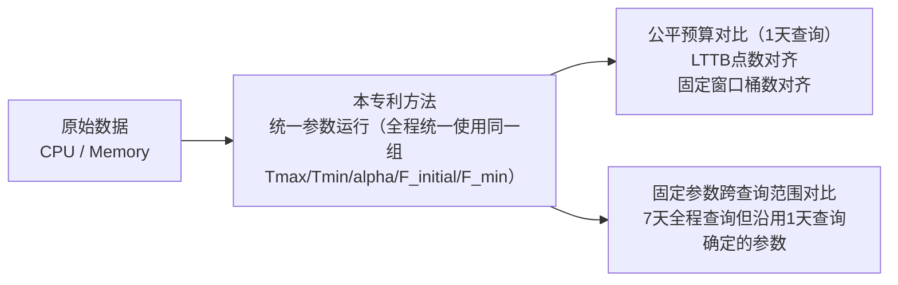
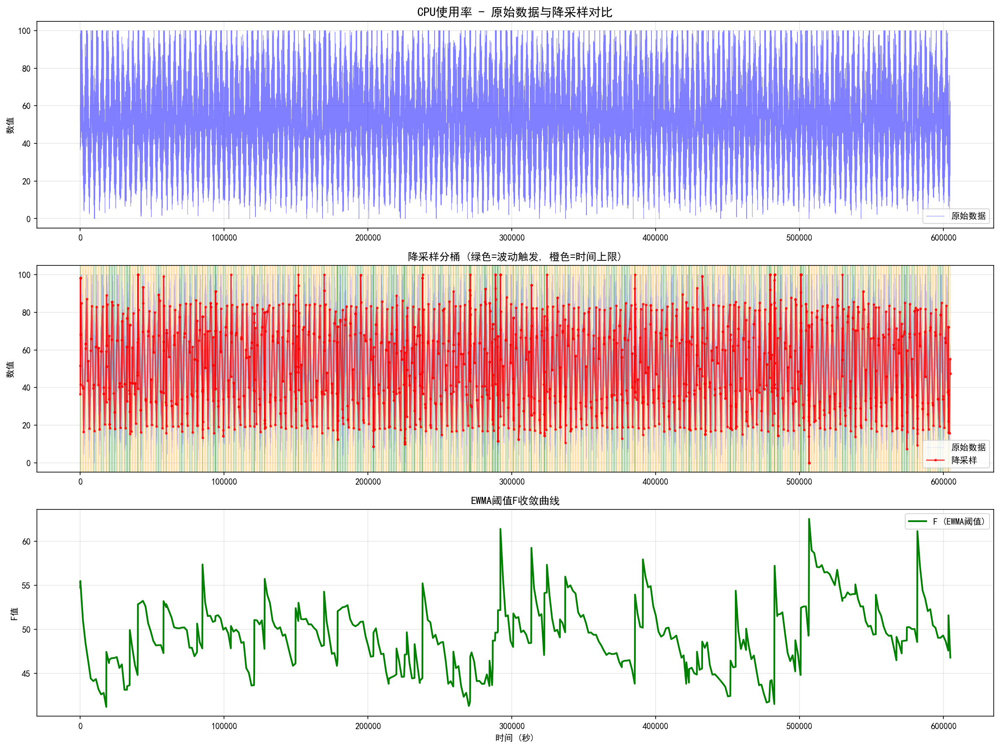
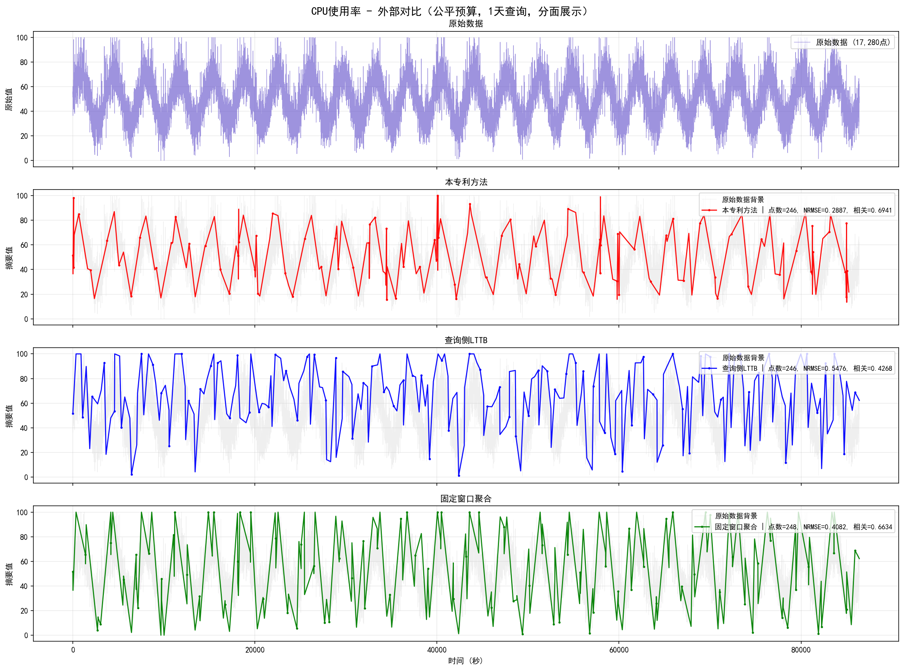
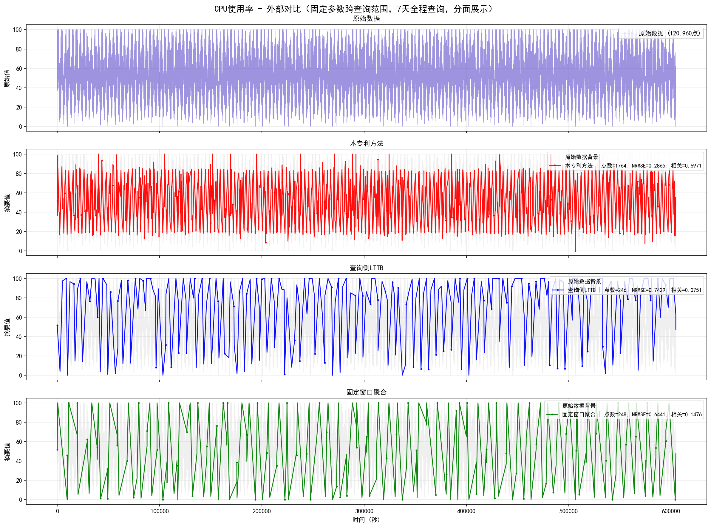
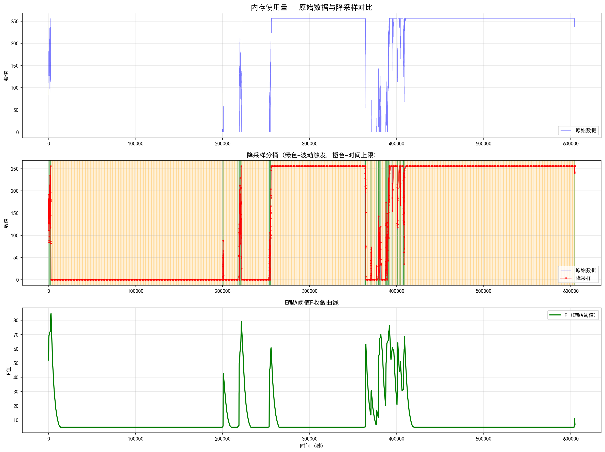
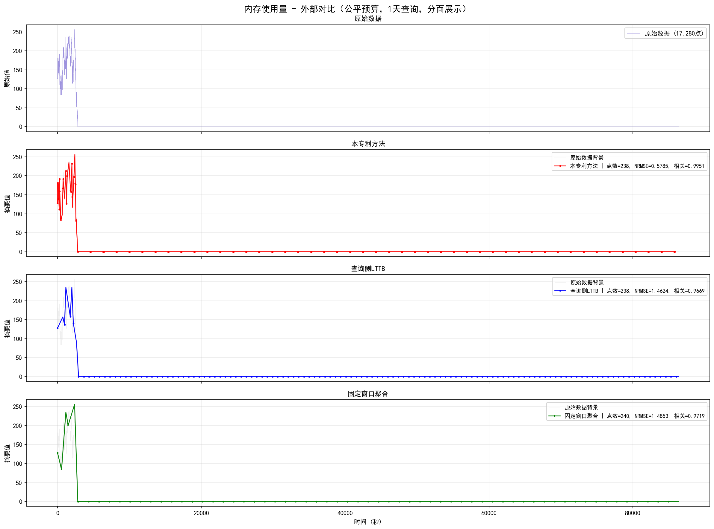
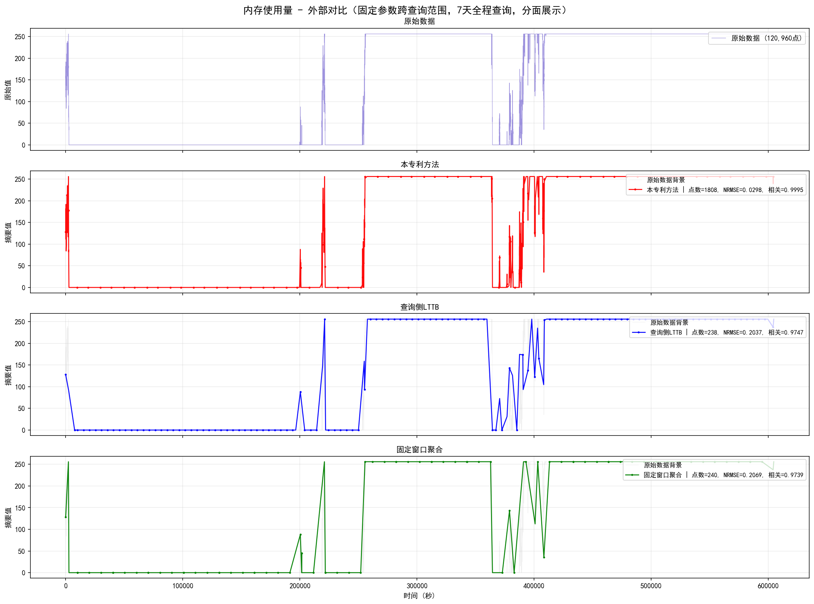

# 实验1图文摘要：CPU + Memory 双场景综合验证

## 🔬 实验目的

本实验用于支撑专利《一种时序数据的写时增量自适应降采样方法及系统》的以下主张：

1. 在**统一参数**下，本专利方法能够跨不同数据形态的监控指标自动适配，无需针对每类指标单独调参。
2. 在写时增量处理前提下，本专利方法仍能保持较好的**趋势保真度**。
3. 与外部对比方法相比，本专利方法不仅在**公平输出预算**下具有更好的趋势重建效果，而且在**固定参数跨查询范围**条件下更不依赖人工调参。
4. 通过跨场景与跨查询范围对比，验证本专利方法在减少查询侧调参与保持趋势保真方面的综合技术效果。

---

## 🧪 实验设计

### 场景设置

| 场景 | 原始数据点数 | 数据形态 | 说明 |
| --- | ---: | --- | --- |
| CPU 使用率 | 120,960 | 周期波动 + 噪声 + 尖峰 | 适合验证对连续周期趋势的保真能力 |
| 内存使用量 | 120,960 | 平台段 + 阶跃变化 + 局部回落 | 适合验证对结构性台阶信号的保真能力 |

> 说明：本次运行默认复用已有 `raw_data`，因此每个场景的原始数据点数为 `120,960`，对应较长时段的固定采样记录。
> 核对基准：本文中的表格、正文和图片口径统一以 `experiment1_results_current.json` 为准。

### 统一参数

| 参数 | 数值 |
| --- | ---: |
| `Tmax` | 1800 秒 |
| `Tmin` | 60 秒 |
| `alpha` | 0.4 |
| `F_initial` | 50.0 |
| `F_min` | 5.0 |

### 外部对比协议

---

## 📋 按场景综合解读

### CPU 场景

CPU 场景用于验证本专利方法对周期波动、叠加噪声和局部尖峰序列的趋势保持能力，以及查询范围变化时的稳定性。

#### 1. 本专利方法综合结果

| 原始点数 | 桶数 | 可视化点数 | 存储压缩比 | 可视化压缩比 | 最终F值 | F收敛速度 | F稳态CV | 相关系数 | NRMSE |
| ---: | ---: | ---: | ---: | ---: | ---: | ---: | ---: | ---: | ---: |
| 120,960 | 441 | 1,764 | 274.3:1 | 68.6:1 | 46.80 | 13 桶 | 0.0269 | 0.6971 | 0.2865 |

| 平均桶宽(秒) | 中位桶宽(秒) | 波动触发占比 | 时间上限占比 | 自适应解读 |
| ---: | ---: | ---: | ---: | --- |
| 1371.42 | 1790.00 | 50.34% | 49.43% | 波动触发与时间上限触发较均衡，说明阈值与周期波动基本匹配 |

- 原始 CPU 序列具有明显周期性起伏，并叠加噪声和局部尖峰。
- 红色 4 点摘要能够跟随主要包络线变化；绿色与橙色背景交替分布，说明该场景下既有波动触发，也有时间上限触发。
- `F` 在前十余个桶后进入稳定区间，说明 EWMA 阈值能够较快收敛并适配该类周期型数据。

#### 2. 公平预算对比

| 方法 | 输出点数 | 压缩比 | 相关系数 | NRMSE | 写入耗时(ms) | 查询耗时(ms) | 调参要求 |
| --- | ---: | ---: | ---: | ---: | ---: | ---: | --- |
| 本专利方法 | 246 | 70.24:1 | 0.6941 | 0.2887 | 4235.506 | 1.423 | 统一参数，无需额外调参 |
| 查询侧LTTB | 246 | 70.24:1 | 0.4268 | 0.5476 | 0.000 | 8.511 | 需预设输出点数(246) |
| 固定窗口聚合 | 248 | 69.68:1 | 0.6634 | 0.4082 | 0.000 | 2.219 | 需预设窗口数(62) |

- 在1天查询窗口内，三种方法按相同输出预算进行比较。
- 本专利方法的红色曲线对周期包络保持最稳定，LTTB 的蓝色曲线更抖，固定窗口的绿色曲线对局部峰谷存在过平滑。
- 在该场景下，本专利方法 `NRMSE=0.2887`，优于 LTTB 的 `0.5476` 和固定窗口聚合的 `0.4082`；对应相关系数 `0.6941` 也高于 LTTB 的 `0.4268` 与固定窗口聚合的 `0.6634`。
- 本专利方法的查询耗时约 `1.423 ms`，是三者中最轻量的查询路径。

#### 3. 固定参数跨查询范围对比

| 方法 | 固定参数 | 输出点数 | 压缩比 | 相关系数 | NRMSE | 查询耗时(ms) | 结论 |
| --- | --- | ---: | ---: | ---: | ---: | ---: | --- |
| 本专利方法 | 同一组 `Tmax/Tmin/alpha/F_initial/F_min` | 1764 | 68.57:1 | 0.6971 | 0.2865 | 1.423 | 7天全程查询下仍保持稳定 |
| 查询侧LTTB | 固定使用1天查询时确定的 `246` 点 | 246 | 491.71:1 | 0.0751 | 0.7429 | 52.105 | 查询范围扩大后明显退化 |
| 固定窗口聚合 | 固定使用1天查询时确定的 `62` 桶 | 248 | 487.74:1 | 0.1476 | 0.6441 | 7.179 | 查询范围扩大后压缩更强，但误差显著高于本专利方法，相关系数也显著弱于本专利方法 |

- 当查询范围从1天扩大到7天全程后，外部方法仍沿用1天查询时确定的参数，趋势表达明显变差。
- 本专利方法直接读取写时生成的结果，输出点数自然扩展到 `1764`，不需要在查询阶段重新决定点数或桶数。
- 该场景说明本专利方法不仅能跟住周期包络，还能在查询范围扩大后维持较稳定的误差水平；同时其查询耗时约 `1.423 ms`，低于固定窗口聚合的 `7.179 ms` 和 LTTB 的 `52.105 ms`。

### Memory 场景

Memory 场景用于验证本专利方法对长平台、阶跃变化和局部回落等结构型序列的保真能力，以及在低波动场景下的参数自适应效果。

#### 1. 本专利方法综合结果

| 原始点数 | 桶数 | 可视化点数 | 存储压缩比 | 可视化压缩比 | 最终F值 | F收敛速度 | F稳态CV | 相关系数 | NRMSE |
| ---: | ---: | ---: | ---: | ---: | ---: | ---: | ---: | ---: | ---: |
| 120,960 | 452 | 1,808 | 267.6:1 | 66.9:1 | 6.70 | 28 桶 | 0.3168 | 0.9995 | 0.0298 |

| 平均桶宽(秒) | 中位桶宽(秒) | 波动触发占比 | 时间上限占比 | 自适应解读 |
| ---: | ---: | ---: | ---: | --- |
| 1338.04 | 1805.00 | 29.42% | 70.35% | 更多由时间上限闭桶，说明内存场景整体更平稳，结构以平台段为主 |

- 内存序列主要表现为长平台、陡降和局部回升等台阶型结构。
- 本专利方法的红色曲线几乎完整保留关键结构，相关系数达到 `0.9995`。
- `F` 最终收敛到较低水平，说明该场景波动尺度较小、结构性更强，阈值能够自动下调以适配平台段数据。

#### 2. 公平预算对比

| 方法 | 输出点数 | 压缩比 | 相关系数 | NRMSE | 写入耗时(ms) | 查询耗时(ms) | 调参要求 |
| --- | ---: | ---: | ---: | ---: | ---: | ---: | --- |
| 本专利方法 | 238 | 72.61:1 | 0.9951 | 0.5785 | 2228.863 | 1.522 | 统一参数，无需额外调参 |
| 查询侧LTTB | 238 | 72.61:1 | 0.9669 | 1.4624 | 0.000 | 9.982 | 需预设输出点数(238) |
| 固定窗口聚合 | 240 | 72.00:1 | 0.9719 | 1.4853 | 0.000 | 2.244 | 需预设窗口数(60) |

- 在1天查询窗口内，三种方法都能保留整体台阶轮廓，但本专利方法在边沿位置和局部回落位置更接近原始序列。
- 在该场景下，本专利方法 `NRMSE=0.5785`，仍优于 LTTB 的 `1.4624` 和固定窗口聚合的 `1.4853`；本专利方法的相关系数 `0.9951` 也略优于 LTTB 的 `0.9669` 和固定窗口的 `0.9719`。
- 本专利方法的查询耗时约 `1.522 ms`，仍快于固定窗口聚合和 LTTB。

#### 3. 固定参数跨查询范围对比

| 方法 | 固定参数 | 输出点数 | 压缩比 | 相关系数 | NRMSE | 查询耗时(ms) | 结论 |
| --- | --- | ---: | ---: | ---: | ---: | ---: | --- |
| 本专利方法 | 同一组 `Tmax/Tmin/alpha/F_initial/F_min` | 1808 | 66.90:1 | 0.9995 | 0.0298 | 1.522 | 7天全程查询下仍保持稳定 |
| 查询侧LTTB | 固定使用1天查询时确定的 `238` 点 | 238 | 508.24:1 | 0.9747 | 0.2037 | 56.278 | 查询范围扩大后误差明显上升 |
| 固定窗口聚合 | 固定使用1天查询时确定的 `60` 桶 | 240 | 504.00:1 | 0.9739 | 0.2069 | 9.516 | 查询范围扩大后误差明显上升 |

- 当查询范围从1天扩大到7天全程后，LTTB 和固定窗口若仍沿用1天查询确定的参数，其对长平台与陡降位置的表达会变得更粗糙。
- 本专利方法仍保持同一组写时参数，输出点数自然扩展到 `1808`，不需要针对查询范围变化额外重设参数。
- 该场景说明本专利方法对结构型、低波动信号同样具有较高保真度，即使查询范围从1天扩展到7天也能保持平台段与边沿位置的表达稳定性，且误差显著低于外部方法；同时查询耗时约 `1.522 ms`，低于固定窗口聚合的 `9.516 ms` 和 LTTB 的 `56.278 ms`。

---

## 🧾 可直接写入专利交底书的实施例文案

### 实施例名称

**实施例一：统一参数下 CPU 与内存监控指标的综合验证实验**

### 实施例正文

为验证本发明所述写时增量自适应降采样方法在不同类型监控指标上的统一参数适配能力、趋势保真能力以及相对于现有方法的综合技术效果，构建 CPU 使用率与内存使用量双场景综合实验。CPU 使用率数据表现为周期波动叠加噪声和局部尖峰，内存使用量数据表现为长平台、阶跃变化和局部回落，两者在数据形态上存在明显差异，能够代表典型连续型监控指标与结构型监控指标。

实验中，两类场景均复用已持久化保存的原始时序数据，每类原始数据点数为 120,960 点。对两类场景统一采用如下参数：时间上限 `Tmax=1800s`、最小累计时长 `Tmin=60s`、EWMA 平滑系数 `alpha=0.4`、初始波动阈值 `F_initial=50.0`、阈值下限 `F_min=5.0`。实验中不针对具体指标进行单独调参，从而验证本发明阈值可随数据特征自动收敛。

实验结果表明，本发明方法在 CPU 使用率场景下形成 441 个降采样桶，最终阈值 `F` 收敛到 46.80；在内存使用量场景下形成 452 个降采样桶，最终阈值 `F` 收敛到 6.70。该结果说明，在统一参数条件下，阈值能够依据不同数据的波动尺度自动演进，而无需为不同指标分别预设阈值。CPU 场景下，本发明方法的相关系数为 0.6971，归一化重建误差为 0.2865；内存场景下，本发明方法的相关系数为 0.9995，归一化重建误差为 0.0298，说明本发明方法对周期型与台阶型监控序列均具有较好的趋势保持能力。

进一步地，采用查询侧 LTTB 和固定窗口聚合作为外部对比方法，并设置两类对比协议。第一类为公平预算对比：仅在前1天查询窗口内进行对比，LTTB 的输出点数与本发明方法1天查询下的输出点数对齐，固定窗口聚合的窗口数与本发明方法1天查询下的桶数对齐。结果显示，在 CPU 场景下，本发明方法1天查询输出 246 点、形成 62 个等效桶，其归一化重建误差为 0.2887，优于 LTTB 的 0.5476 和固定窗口聚合的 0.4082，查询耗时约为 `1.423 ms`，低于固定窗口聚合的 `2.219 ms` 和 LTTB 的 `8.511 ms`；在内存场景下，本发明方法1天查询输出 238 点、形成 60 个等效桶，其归一化重建误差为 0.5785，仍优于 LTTB 的 1.4624 和固定窗口聚合的 1.4853，查询耗时约为 `1.522 ms`，低于固定窗口聚合的 `2.244 ms` 和 LTTB 的 `9.982 ms`。该结果说明，在相同输出预算下，本发明方法同时具有更好的趋势保真性能和更轻量的查询路径。

第二类为固定参数跨查询范围对比：首先在1天查询窗口内确定外部方法的参数，其中 CPU 场景下 LTTB 固定为 246 点、固定窗口聚合固定为 62 桶，Memory 场景下 LTTB 固定为 238 点、固定窗口聚合固定为 60 桶；随后在7天全程查询窗口中，LTTB 与固定窗口聚合继续沿用该1天查询确定的参数不变，而本发明方法仍保持同一组 `Tmax/Tmin/alpha/F_initial/F_min` 参数并直接读取写时生成结果。结果表明，当查询范围从1天扩展到7天后，CPU 场景下 LTTB 的归一化重建误差上升至 0.7429、查询耗时上升到 `52.105 ms`，固定窗口聚合的归一化重建误差为 0.6441、查询耗时约为 `7.179 ms`；Memory 场景下 LTTB 的归一化重建误差为 0.2037、查询耗时约为 `56.278 ms`，固定窗口聚合的归一化重建误差为 0.2069、查询耗时约为 `9.516 ms`，均高于本发明方法在7天全程查询下的 0.2865 和 0.0298，且查询耗时也高于本发明方法的 `1.423 ms` 和 `1.522 ms`。该结果表明，本发明方法在查询范围扩大时无需重新设定查询侧参数，仍能保持稳定结果。

综上，本实施例验证了：本发明方法在统一参数下能够跨不同数据形态的监控指标自动适配，并在公平预算与固定参数跨查询范围两类对比协议下均表现出优于查询侧 LTTB 与固定窗口聚合方法的综合效果，从而证明本发明在减少查询侧调参、保持趋势保真以及写时增量处理方面具有明显技术优势。

---

## 结论

1. `CPU + Memory` 两个场景已经足够支撑“统一参数跨数据形态适配 + 固定参数跨查询范围对比”的核心故事。
2. **公平预算对比**表达的是：“在1天查询、相同输出预算下，本专利保真更好？”。
3. **固定参数跨查询范围对比**表达的是：“查询范围从1天扩大到7天但外部方法不重新调参时，本专利更稳？”。
4. **整体结论**是：主实验只用 CPU 与 Memory 两个场景，已经足以支撑“统一参数跨场景适配 + 1天公平预算 + 7天跨查询范围”的核心故事。
