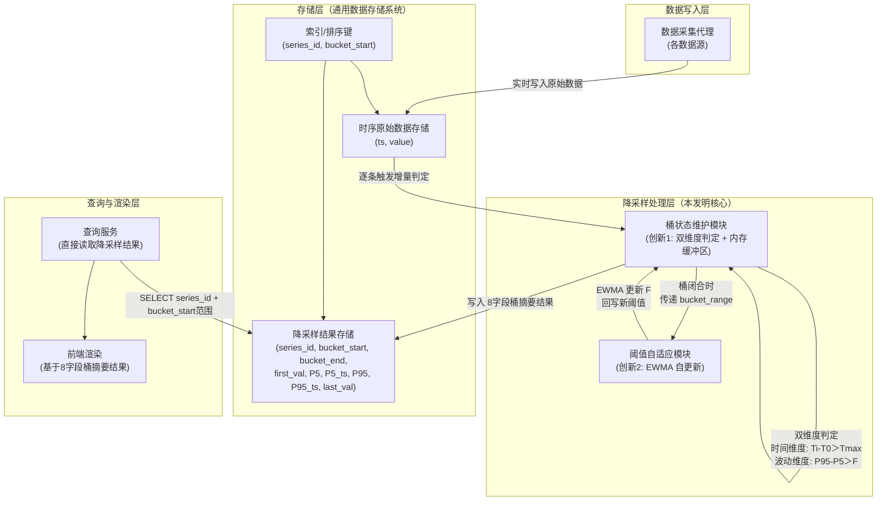
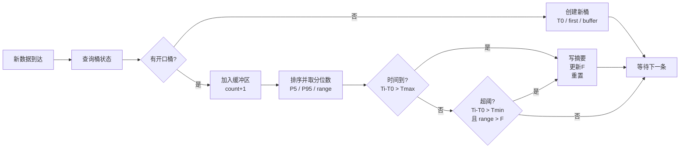
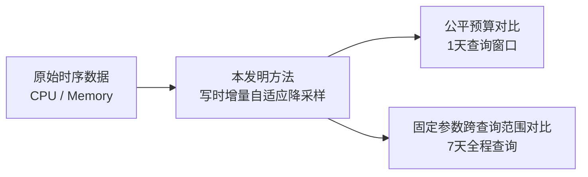

# 技术交底书

**案件名称**：一种时序数据的写时增量自适应降采样方法及系统

**技术联系人**：

- 姓名：待填写
- 电话：待填写
- 邮箱：待填写

**专利类型**：发明

---

## 注意事项

（1）交底书应使代理人能看懂，尤其是背景技术和详细技术方案，一定要写得全面、清楚、完整；
（2）技术的公开程度，应以本领域普通技术人员不需付出创造性劳动即可进行实施为准。
（3）在与代理人沟通时，对于代理人咨询的技术问题，应给予回答并认真讲解，并且按要求及时正确地补充相应技术材料。

---

## 一、介绍相关技术背景，描述与本发明技术最相近的现有技术，并说明该现有技术存在的缺点

### 1.1 现有技术

本发明涉及时序数据存储、查询优化与可视化处理领域，具体涉及一种在通用数据存储系统上对大规模时序监控数据执行写时增量自适应降采样的方法与系统。

经多阶段检索：（一）国家知识产权局中国专利公布公告（检索工具：cnipa_epub_search.py），以"写时降采样""增量桶划分""写时聚合""自适应降采样""物化视图 时序 聚合""EWMA 阈值 自适应"等 10 余组检索词进行多轮独立检索，检索日期 2026-05-28 至 2026-05-31；（二）国际学术与专利数据库（Google Patents、Google Scholar），以"EWMA adaptive threshold time series streaming""percentile downsampling bucket patent""write-trigger downsampling"等检索词进行补充检索；（三）对项目提供的对标专利文献进行全文分析。现按技术方向分类，将与本方案最接近的现有技术列举如下：

---

**方向一：查询侧降采样算法（特征点选择类）**

**（1）CN117891972A — 时序数据降采样方法、装置、电子设备及存储介质**

该专利提出一种基于滑动窗口的动态降采样策略选择方法：根据目标输出总量、滑动窗口容量和单个滑窗抽样阈值确定采用连续抽样或间隔抽样策略，在每个滑动窗口内选取目标抽样量的数据点。属于应用层 LTTB 变体。

- 技术方案概括：将全量数据从存储系统加载到应用层内存，以固定数量滑动窗口为单位动态选择抽样策略，每窗口输出一个代表性数据点。
- 局限性：需全量数据加载到内存；选点过程涉及排序，O(n log n)；每桶仅输出 1 个采样点，桶内趋势形态完全丢失；降采样在查询时执行，每次查询需重复扫描全量原始数据。
- 来源链接：http://epub.cnipa.gov.cn/patent/CN117891972A

**（2）CN202011579516 — LTTB+TimeGap 混合算法**

该专利提出将 LTTB 与 TimeGap 时间间隔策略混合的特征点选择降采样方法。

- 局限性：需全量数据加载到内存；O(n log n)；每桶单个特征点，波动信息完全丢失；查询时重复计算。
- 来源：项目参考专利目录

---

**方向二：写时预聚合（预计算降采样）**

**（3）CN122112135A — 用于虚拟晶圆厂的轻量化实时数据同步与处理方法及系统**

该专利提出通过 CDC 工具实时监听数据库增量变更数据，经 Kafka 和 NiFi 将数据写入 TimeScaleDB 时序数据库，利用其内置连续聚合引擎生成物化视图供查询。

- 技术方案概括：CDC→Kafka→NiFi→TimeScaleDB→内置聚合引擎→物化视图。
- 局限性：（a）聚合窗口为 TimeScaleDB 内置的固定时间间隔，窗口粒度由配置静态决定，无法根据数据自身波动特征自适应调节；（b）每窗口输出单个聚合值（均值、最大值等），窗口内趋势形态完全丢失；（c）技术栈绑定 TimeScaleDB+Kafka+NiFi，组件链长、运维成本高。
- 来源链接：http://epub.cnipa.gov.cn/patent/CN122112135A

**（4）CN117891588A — 基于 OpenCL 实现时序数据降采样预计算方法**

该专利提出利用 OpenCL 框架将降采样计算卸载到 GPU/FPGA 上并行执行，桶窗口为固定的预设时间间隔。

- 局限性：（a）依赖 GPU/FPGA 专用硬件；（b）桶窗口为固定间隔，无法自适应调节桶密度；（c）每桶仅输出单个聚合值。
- 来源链接：http://epub.cnipa.gov.cn/patent/CN117891588A

---

**方向三：预测模型降采样**

**（5）CN117520423A — 一种时序数据降采样方法及装置**

该专利提出利用存量时序数据训练多项式预测模型，将采样时间点输入模型直接输出采样结果。

- 局限性：结果为预测近似值而非精确统计值；需离线训练，无法实时响应新增数据；模型倾向于平滑异常峰值。
- 来源链接：http://epub.cnipa.gov.cn/patent/CN117520423A

---

**方向四：分布式大数据处理**

**（6）CN202011467348 — PySpark+Pandas 融合的时序数据处理**

该专利提出通过 PySpark 分布式计算引擎与 Pandas 混合架构处理大规模时序数据。

- 局限性：依赖 Spark 集群，单机不可用；网络 IO 成为瓶颈；架构重、运维成本高。
- 来源：项目参考专利目录

---

**方向五：自适应阈值与动态采样（非降采样可视化领域）**

以下专利涉及自适应阈值或动态采样的概念，但应用于不同领域且本方案中的阈值自适应机制与其存在根本区别。

**（7）CN101051952A — 高速多链路逻辑信道环境下的自适应抽样流测量方法**

该专利提出基于阈值检测-趋势触发（TD²）的自适应报文抽样比调节算法：设置变化速率阈值 K 和偏差量阈值 D 两个固定阈值，当网络流量速率超过 K 或偏差超过 D 时触发抽样比调整。应用于网络流量测量领域。

- 技术方案概括：计算 PPS → 理论抽样比 → K/D 双阈值检测 → 阈值触发时自适应调整抽样比率。
- 与本方案的区别：（a）K 和 D 均为人工预设的固定值，不具备自动调节能力——本方案的 fluctuation_threshold 通过 EWMA 利用已闭合桶的实际波动幅度进行自更新，无需人工设定；（b）该方案自适应的是"抽样比率"（采样频率），本方案自适应的是"桶边界划分"（降采样窗口的切分位置）；（c）应用领域不同——网络流量测量 vs 时序监控数据可视化降采样。
- 来源：http://epub.cnipa.gov.cn/patent/CN101051952A

**（8）CN121327179A — 一种流式数据动态采样方法、装置、设备及介质**

该专利提出获取前两个数据的时间戳差值，若超过预设时间间隔阈值则停止本轮采样，下一轮采用全量采样策略。支持降采样/全量采样的策略切换。

- 与本方案的区别：（a）时间间隔阈值为预设固定值；（b）策略切换在"降采样/全量采样"之间，非桶边界的自适应划分；（c）触发机制为时间间隔超时，非数据波动特征驱动。
- 来源链接：http://epub.cnipa.gov.cn/patent/CN121327179A

---

**检索总结**：

本次正文中保留并重点分析了 8 篇与本案最相关的现有技术，主要覆盖 5 个方向：查询侧降采样算法、写时预聚合、预测模型降采样、分布式大数据处理，以及自适应阈值/动态采样方案。其中，方向五的两篇专利（CN101051952A、CN121327179A）虽然涉及"自适应"和"动态"概念，但其阈值或判定条件仍为人工预设固定值，不具备基于数据自身特征自动调节的能力。综合来看，现有技术主要存在以下 5 个方面的共性不足：

（1）**查询侧降采样方案仍需重复扫描原始数据**——查询范围越大，扫描和计算成本越高，难以保证大范围查询下的稳定查询时延。

（2）**写入侧降采样方案多采用固定时间窗口或固定阈值作为桶划分依据**——方向二中 CN122112135A 和 CN117891588A 的桶窗口为固定配置，方向五中 CN101051952A 的 K/D 阈值为固定预设值，尚未形成由数据自身波动特征实时驱动桶边界判定、且阈值同步自动演进的方案。

（3）**现有方案中降采样关键参数高度依赖人工配置**——CPU 使用率、内存占用量、网络流量等不同指标的纲量差异大，每种指标往往需要单独调参，同一指标在不同阶段也可能需要反复重配。

（4）**基于 raw min/max 的波动度量容易受瞬时毛刺干扰**——单个异常点即可显著放大桶内波动估计，不利于稳定划分桶边界和更新阈值。

（5）**部分现有方案依赖专用硬件或重型技术栈**——CN117891588A 需 GPU/FPGA，CN122112135A 绑定 TimeScaleDB+Kafka+NiFi，方向四中的分布式方案还依赖 Spark 集群，不利于在通用数据存储系统中低成本部署。

本发明围绕上述 5 类不足，形成了从“写入时增量双维度自适应桶划分”到“波动阈值 EWMA 自适应演进”再到“查询阶段直接读取 8 字段桶摘要结果”的完整技术闭环。

### 1.2 现有技术存在的缺点

综合上述分析，存在以下核心缺陷：

**（1）查询侧方案重复扫描原始数据，查询开销随查询范围扩大而显著增加**。方向一的查询侧降采样方案本质上都需要在用户发起请求后重新读取指定时间范围内的全量原始数据，再执行排序、选点和返回。对于监控系统这类高频缩放查询场景，查询范围越大，扫描和计算成本越高，查询延迟波动也越明显。

**（2）桶划分方式僵化，关键参数完全依赖人工配置，难以跨指标复用**。现有写时预聚合方案多以固定时间窗口作为桶划分依据，固定阈值方案则依赖人工预设的变化阈值。对于不同类型监控指标的纲量差异（如 CPU 使用率、内存使用量、网络流量等），往往需要分别调参；同一指标在不同时间阶段的数据特征发生变化后，原有参数也容易失效。

**（3）对数据形态变化和查询范围变化的适应性不足**。现有方案通常只能在某一固定查询范围或某一种典型波动模式下工作良好。当查询范围从 1 天扩展到 7 天甚至更长时，查询侧方案往往需要重新设定输出点数或桶数；当数据从长时间平稳切换到局部剧烈波动时，固定窗口或固定阈值方案又难以持续保持合理的桶密度。

**（4）基于原始最大值/最小值的波动度量容易受瞬时毛刺干扰**。若以 raw min/max 计算桶内极差，则单个异常点即可显著放大桶内波动估计，导致桶边界误判，并进一步干扰后续阈值更新或窗口划分。这会使系统在尖峰、毛刺较多的监控数据场景下稳定性较差。

**（5）部分现有方案基础设施依赖重或技术栈绑定深**。方向二中的 CN117891588A 依赖 GPU/FPGA 专用硬件，CN122112135A 绑定 TimeScaleDB+Kafka+NiFi 完整链路，方向四中的方案依赖 Spark 集群。这些方案不利于在通用数据存储系统中以较低成本直接部署。

---

## 二、针对上述缺点，说明本发明所要解决的技术问题

本发明所要解决的技术问题是：**在不依赖 GPU/FPGA 专用硬件、不引入分布式计算集群、不绑定特定数据库产品的前提下，如何在通用数据存储系统上实现大规模时序数据的实时降采样，使降采样结果在数据写入时即自动生成且实时可见，桶划分的判定阈值随数据特征自动调节而无需人工配置，且桶内极值的提取能有效抵抗瞬时毛刺干扰**。围绕前述 5 类缺点，具体包括以下 5 个技术问题：

（1）如何将降采样操作从查询侧前移到写入侧，避免在每次查询时重复扫描指定时间范围内的全量原始数据，从而在查询范围扩大时仍保持稳定、轻量的查询路径。

（2）如何在每条原始数据入库时，以轻量级增量状态机实时判定桶边界，使桶划分不再依赖预设固定时间窗口，而是由时间上限 `Tmax` 与波动阈值 `F` 双维度条件共同驱动。

（3）如何使波动判定阈值随数据自身的波动特征自动调节，消除人工跨指标、跨时间调参的负担，使同一组参数能够适配 CPU、内存等不同量纲和不同波动模式的监控指标。

（4）如何在写时增量处理过程中，提取既能表征桶内主要波动、又不易受瞬时毛刺干扰的特征量，用于稳定地驱动桶划分和阈值更新。

（5）如何使上述方案能够建立在通用数据存储系统与常规软件栈之上，不依赖专用硬件、分布式集群或特定数据库中间件，从而降低部署和集成门槛。

---

## 三、本发明技术方案的详细阐述

### 3.1 背景

本发明适用于如下典型场景：一个基于通用数据存储系统的监控系统，数十个计算节点每 5 至 60 秒采集一次 CPU/GPU/内存使用率等监控数据写入存储系统。Web 前端监控面板需展示"指定时间段的资源使用率趋势曲线"。用户查询的时间范围可以是任意起止时间，也可以是滑动窗口。

现有方案中，监控系统的运维人员需要为每种指标单独配置波动阈值，而且月初配好的 GPU 使用率阈值，到月末因训练任务变更可能需要重调。本发明的核心思路是：**将降采样操作从查询时前移至写入时，且使判定阈值随数据自动演进**。

每当一条原始监控数据写入存储系统时，即触发一次增量桶划分判定——维护一个轻量级状态机，在内存缓冲区中暂存当前开口桶内所有数据点的 (value, timestamp) 对，对每条新数据以时间上限和累计波动两个条件实时判定是否需要闭合当前桶，其中累计波动以桶内数据的 P5/P95 分位极差（代替 raw min/max 以抵抗瞬时毛刺）度量。桶闭合时，以该桶的实际波动幅度通过 EWMA 更新波动阈值；同时从缓冲区中直接输出该桶的首值、P5 分位值、P95 分位值、末值及其时间戳组成的 8 字段桶摘要结果，并结合 `series_id` 写入降采样结果存储。查询时直接从降采样结果中读取，无需扫描全量原始数据。

### 3.2 系统框图





### 3.3 模块功能说明

**（1）数据采集代理**：部署于各数据源端，定时采集监控指标数据，以整型 Unix 时间戳和浮点数值的形式写入存储系统的时序原始数据存储结构。

**（2）时序原始数据存储**：存储系统中的原始监控数据存储结构。时间戳字段采用整型存储 Unix 时间戳，数值字段采用浮点类型存储监控指标值。存储结构支持按时间戳的快速查找和有序范围扫描。

**（3）降采样结果存储**：存储已闭合桶对应的 8 字段桶摘要结果，并额外记录 `series_id` 作为序列标识。每行优选包含：series_id（用于区分 CPU、内存等不同监控序列）、bucket_start（桶起始时间戳）、bucket_end（桶结束时间戳）、first_val（桶内首个值）、P5_val（桶内 P5 分位值）、P5_ts（P5 出现的时间戳）、P95_val（桶内 P95 分位值）、P95_ts（P95 出现的时间戳）、last_val（桶内末尾值）。存储结构支持按 `series_id + bucket_start` 的快速范围查询。

**（4）桶状态维护模块（创新 1——写入时增量双维度自适应桶划分）**：本发明的核心模块。在每条原始数据写入时触发，维护一个轻量级增量状态机。状态机记录当前开口桶的如下状态：

| 状态变量 | 含义 |
|---------|------|
| T0 | 桶起始时间戳 |
| first_val | 桶内第一条数据的值 |
| buffer[] | 桶内数据点缓冲区，每项为 (value, timestamp) |
| count | 桶内累计数据条数 |

对每条新数据 (Ti, Vi)，执行以下操作：

```
// 若当前无开口桶，则创建新桶，并将首点同步写入 buffer
IF no_open_bucket THEN
    T0 = Ti
    first_val = Vi
    buffer = [(Vi, Ti)]
    count = 1
    等待下一条数据
ELSE
    // 将新数据点加入缓冲区
    buffer.append((Vi, Ti))
    count += 1

    // 按值排序，取精确分位数及对应时间戳
    sort(buffer by value)
    P5_val  = buffer[floor(count × 0.05)].value
    P5_ts   = buffer[floor(count × 0.05)].timestamp
    P95_val = buffer[floor(count × 0.95)].value
    P95_ts  = buffer[floor(count × 0.95)].timestamp
    bucket_range = P95_val - P5_val

    // 双维度切桶判定
    条件1 (时间维度): Ti - T0 > Tmax  →  安全阀，防止桶无限拉长
    条件2 (波动维度): Ti - T0 > Tmin  AND  bucket_range > F  →  数据驱动切桶

    IF 条件1 OR 条件2 THEN
        闭合当前桶，输出 8 字段桶摘要结果：
            (T0, Ti, first_val, P5_val, P5_ts, P95_val, P95_ts, last_val=Vi)
        EWMA 更新 F（见模块 (5)）
        // 以当前点开启下一开口桶，并同步写入 buffer
        T0=Ti
        first_val=Vi
        buffer=[(Vi, Ti)]
        count=1
    ELSE
        不切桶，等待下一条数据
    END IF
END IF
```

其中 `Tmax` 为时间上限参数（如 1800 秒），`Tmin` 为最小累计时长参数（如 60 秒，防止桶刚开启时误切），`F` 为波动阈值（由创新 2 的 EWMA 自动维护）。

采用 P5/P95 分位数代替 raw min/max 度量桶内波动幅度的目的是抵抗瞬时毛刺——单个异常数据点仅影响排序后第 5% 或 95% 位置附近的取值，对 P5/P95 分位值的影响极小，不会导致 bucket_range 剧烈跳变而误切桶。单桶数据量受 Tmax 约束（以 Tmax=1800 秒、采集间隔 5 秒计，单桶最多约 360 条数据），在内存中对数百条数据进行排序和分位数提取的时间可忽略，以常规精确方式实现即可。

**（5）阈值自适应模块（创新 2——波动阈值的 EWMA 自适应调节）**：波动阈值 `F` 不再由人工预设，而是通过指数加权移动平均（EWMA）随每个闭合桶的实际波动幅度自动演进。

- **背景**：不同监控指标的纲量差异大——CPU 使用率（%）、内存占用量（GB）、网络流量（Mbps）等，每种指标均需独立配置阈值，部署和维护成本高。且同一指标的数据特征随时间漂移，人工预设值难以长期保持合适。EWMA 自更新机制使阈值随数据自动适配，消除人工调参负担。

- **更新公式**：每闭合一个桶，获得该桶的精确分位数波动幅度 `bucket_range = P95_val - P5_val`，然后：

```
F_new = α × bucket_range + (1-α) × F_old
F = max(F_new, F_min)
```

其中 `α` 为平滑系数（0 < α < 1），α 值越大，阈值对近期桶的波动幅度越敏感，适应速度越快；α 值越小，阈值越平滑，抗短期异常能力越强；`F_min` 为阈值下限（如初始值的 10%），防止阈值衰减到噪声级别。

- **过渡期效应与稳态行为**：

本机制的"自适应"体现在两个层面。**层面一（过渡期）**：当数据特征发生变化时——例如从平稳期转入剧烈波动期——由于 EWMA 阈值 F 尚未跟上实际波动水平，条件 2（bucket_range > F）极易触发，桶在达到 Tmax 前提前闭合，桶宽缩短；反之，从剧烈波动期转入平稳期时，F 偏高导致条件 2 难以触发，桶宽趋近 Tmax（拉长）。这一过渡期效应是桶宽随数据特征自动调整的主要作用窗口。**层面二（稳态）**：当 F 收敛至实际波动水平后，桶宽主要由 Tmax 约束，EWMA 的作用转为持续跟踪数据的真实波动特征，使判定条件始终与当前数据分布匹配，消除人工定期重调阈值的运维负担。

- **两种闭合原因下的自然效果**：

| 闭合原因 | bucket_range 的大小 | EWMA 效果 |
|---------|-------------------|-----------|
| 条件 2 触发（波动超阈值） | bucket_range 较大（≥ 当前 F） | F 被拉高，跟踪真实波动水平 |
| 仅条件 1 触发（时间到，波动始终不够） | bucket_range 较小（< 当前 F） | F 被缓慢拉低，逼近数据真实平稳水平 |

不需要按触发原因区分更新路径——EWMA 本身即可正确处理两种场景。持续稳定期间（连续多个桶仅由条件 1 触发），每个桶的小 bucket_range 驱动 F 逐步下降，直到匹配数据的真实波动水平；进入波动期后，条件 2 触发的桶将 F 拉回合理水平。

- **初始化**：F 的初始值可设为前若干个桶（如 10 个）的 bucket_range 均值，也可从预设的保守值开始（如 50），由 EWMA 自动收敛到合适水平。

**（6）查询服务与前端渲染模块**：查询服务接收前端请求后，直接对降采样结果存储执行按 `series_id + bucket_start` 的范围查询，结果按 bucket_start 升序返回。无需访问原始数据存储，无需聚合计算。前端基于 8 字段桶摘要结果进行渲染。由于 P5_ts 与 P95_ts 的时间先后顺序取决于桶内数据的实际分布（峰值可能在谷值之前或之后），渲染前需将其中 4 个值点按时间戳升序排列后依次连线：

```
排序后：(t1, v1) → (t2, v2) → (t3, v3) → (t4, v4)
其中 {t1,t2,t3,t4} = {bucket_start, P5_ts, P95_ts, bucket_end} 按升序排列
```

折线的斜率反映桶内数据的实际变化速率——斜率越陡表示变化越剧烈。相较于传统方案每桶仅输出单个均值点、相邻桶之间仅一条水平直线段的方式，8 字段桶摘要结果中的 4 个值点能勾勒桶内数据的大致趋势方向。

### 3.4 系统流程说明

#### 3.4.1 写入流程





**流程说明**：

**写入阶段**——每条原始数据入库时触发：

1. 新数据到达，携带时间戳（整型 Unix 秒或毫秒）和指标值（浮点）。
2. 查询当前开口桶状态。若无开口桶（首次写入或上一个桶刚闭合），创建新开口桶：T0=当前时间戳，first_val=当前值，buffer=[(当前值, 当前时间戳)]，count=1。流程结束。
3. 若开口桶已存在，将 (value, timestamp) 加入缓冲区，count+=1。对缓冲区按值排序，取第 5% 和 95% 位置的数据点，得到精确的 P5_val、P5_ts、P95_val、P95_ts 及 bucket_range = P95_val - P5_val。
4. 执行双维度切桶判定：
   - 条件 1（时间上限）：Ti - T0 > Tmax → 安全阀，防止桶无限拉长。
   - 条件 2（波动阈值）：(Ti - T0 > Tmin) AND (bucket_range > F) → 数据驱动切桶，`F` 为当前 EWMA 波动阈值。
   - 不满足 → 等待下一条数据。
5. 桶闭合时：将缓冲区中已排序的 8 字段桶摘要结果输出至降采样结果存储；调用 `F = max(α × bucket_range + (1-α) × F, F_min)` 更新阈值；并以当前点开启下一开口桶，同时将该点同步写入新桶的 buffer。

**查询阶段**：

1. 查询服务接收请求，按 bucket_start 范围检索降采样结果。
2. 当前开口桶以临时 bucket_end 拼接。前端以实际时间戳渲染折线。全程无需扫描原始数据。

#### 3.4.2 两项创新的协同关系

- **创新 1** 决定"何时切桶"——在写入路径上以双维度条件驱动，在内存缓冲区中维护桶内数据点，排序后以精确的 P5/P95 分位极差判定桶边界。
- **创新 2** 决定"切桶阈值是多少"——利用每个闭合桶的精确分位数波动幅度通过 EWMA 自动更新阈值，使创新 1 的判定条件始终适应当前数据的波动特征。

两者闭环协同：创新 1 在桶闭合时输出精确波动幅度；创新 2 消费该波动幅度，更新阈值反馈给创新 1 供下一个开口桶使用。

### 3.5 关键技术参数

**（1）时间戳类型**：整型存储 Unix 时间戳，直接参与算术运算，无需类型转换。

**（2）降采样结果存储结构**：以 bucket_start 为排序键，按时间范围检索。

**（3）桶划分参数**：

- `Tmax`（时间上限）：单桶最大时长，通常数千至数万秒。安全阀机制。
- `Tmin`（最小累计时长）：通常数十至数百秒。防止桶刚开启时误切。
- `F`（波动阈值）：**无需人工预设**，由 EWMA 自动维护。初始值可从保守估计开始，随数据自动收敛。

**（4）EWMA 平滑系数 α**：0 < α < 1，推荐取 0.2~0.4。唯一需要设置的阈值调参参数，且对不同类型的监控指标均可使用相同 α 值。α 的含义：每个新闭合桶对 F 的贡献权重为 α，历史桶的权重每步衰减为原来的 (1-α) 倍。以 α=0.4 为例，闭合 3 个桶后，第 1 个桶的权重已降至 (0.6)³ ≈ 21.6%，闭合 4 个桶后降至约 13.0%——即 F 主要由最近数个桶的波动幅度决定，能够更快跟随数据特征变化。

**（5）内存缓冲区**：以 (value, timestamp) 对的形式暂存当前开口桶内全部数据点。单桶数据量受 Tmax 约束（以 Tmax=1800 秒、采集间隔 5 秒计，约 360 条），每条数据 16 字节（双精度浮点值 + 64 位整数时间戳），单桶内存开销约 6 KB。排序取分位数的操作为常规精确计算，非本发明的优化对象。

**（6）部署灵活性**：本方法仅依赖通用数据存储系统的基础能力（整型存储、按时间戳排序、范围查询）。状态机可在应用层实现（推荐），也可嵌入存储系统的触发器中。

---

## 四、与现有技术相比，本发明具有哪些优点？

**总述**：与现有技术侧重"让单次查询更快"（查询侧降采样）或"用固定窗口/固定阈值预计算"（写时预聚合、TD²）的思路不同，本发明提出了一条从"写入时增量双维度桶划分"到"阈值 EWMA 自适应演进"的完整技术管线。降采样结果在数据写入时即自动产生且实时可见，查询时无需再扫描全量原始数据。判定阈值随数据自动调节，无需人工跨指标配置。上述优点不仅来自理论分析，也已经在本交底书第六部分的 CPU 使用率与内存使用量双场景实施例中得到验证。

**核心优点**：

**（1）写入即降采样，查询零计算，数据实时可见**。与查询侧方案每次扫描全量数据不同，本方案在数据写入时完成增量桶划分和阈值更新，降采样结果实时写入持久化存储，查询时直接从结果读取。实施例中，在 7 天全程查询下，CPU 场景的查询耗时约为 `1.423 ms`、内存场景约为 `1.522 ms`；作为对比，查询侧 LTTB 分别上升到 `52.105 ms` 和 `56.278 ms`，固定窗口聚合也分别需要约 `7.179 ms` 和 `9.516 ms`。这说明本方案通过将主要处理过程前移到写入阶段，使查询路径保持轻量、稳定，更适合监控系统中的频繁缩放与大范围回看场景。

**（2）波动阈值随数据特征自动演进，消除人工调参负担**。与现有方案中波动阈值（或 K/D 等判定参数）由人工一次性预设且跨指标需分别配置的做法不同，本方案的波动阈值 F 通过 EWMA 利用每个闭合桶的实际分位数波动幅度进行自更新——无需关心指标纲量（CPU%、内存 GB、流量 Mbps 均可使用相同 α 值），无需关心数据特征随时间漂移（阈值自动跟踪）。EWMA 的滞后效应使系统在数据特征发生变化时自动产生过渡期调整，稳态下阈值持续跟踪数据真实波动水平以维持判定条件的有效性。实施例中，在完全相同的 `Tmax/Tmin/alpha/F_initial/F_min` 参数下，CPU 场景阈值最终收敛到约 46.80，而内存场景收敛到约 6.70，证明本方案能够在不同数据形态间自动适配，而无需像现有技术那样为不同指标分别预设阈值。

**（3）分位数极值抗毛刺，桶边界更稳定**。与现有方案以 raw min/max 计算波动幅度的做法不同，本方案以 P5/P95 分位数代替极值——单个异常数据点仅影响排序后第 5% 或 95% 位置附近的取值，对分位值的影响极小。即使出现瞬时毛刺，bucket_range 不会剧烈跳变，桶边界不会因单个点而误切。这一抗干扰能力对 EWMA 阈值更新的稳定性至关重要——若 bucket_range 本身受毛刺污染，则 EWMA 更新也会被带偏，形成误差的正反馈。实施例中的 CPU 场景包含明显周期波动、噪声与局部尖峰，本发明方法在此场景下仍可保持 `NRMSE=0.2865`，且在 1 天公平预算对比中优于查询侧 LTTB 的 `0.5476` 和固定窗口聚合的 `0.4082`，说明本方案在存在尖峰扰动时仍能较稳定保持趋势保真。

**（4）零专用硬件依赖，部署灵活**。不需要 GPU/FPGA，不需要 Spark 集群，不绑定特定数据库产品。状态机内存开销约数 KB（单桶缓冲区 + 辅助变量），适用于从边缘设备到云托管环境的各类部署场景。实施例全部在通用软件栈上完成，且对 CPU 使用率、内存使用量两类典型监控指标均取得稳定结果，说明本方案具有较好的工程可落地性。

**（5）查询范围扩大时无需重新调参，跨查询范围稳定性更好**。现有查询侧方案在小范围查询中选定的点数或桶数，扩展到更大查询范围时往往会导致输出密度骤降、趋势表达变粗，需要人工重新设定参数。本方案则不同：写时阶段已经生成降采样结果，查询范围扩大时仅增加读取范围，不需要在查询侧重新决定点数或桶数。实施例中，当查询范围从 1 天扩展到 7 天时，CPU 场景下查询侧 LTTB 的 `NRMSE` 从 `0.5476` 上升到 `0.7429`，固定窗口聚合从 `0.4082` 上升到 `0.6441`；内存场景下 LTTB 和固定窗口聚合分别上升到 `0.2037` 和 `0.2069`，而本发明方法在 7 天全程查询下仍保持 `0.2865` 和 `0.0298` 的稳定结果。该优点直接对应本发明"减少查询侧调参负担"的技术效果。

---

## 五、本发明的技术关键点以及建议重点保护的内容

**技术关键点一：写入时增量双维度自适应桶划分方法（创新 1）**

在每条时序数据写入时触发增量桶划分判定。维护以内存缓冲区为基础的轻量级增量状态机，暂存当前桶内全部数据点的 (value, timestamp) 对。以 P5/P95 分位数代替 raw min/max 抵抗瞬时毛刺——以时间上限 Tmax 和波动阈值 F 为双维度判定条件确定桶边界，Tmax 作为安全阀防止桶无限拉长，F 与分位数极差（P95-P5）比较作为数据驱动的切桶判定。在数据特征变化期，EWMA 阈值的滞后效应使桶宽自动向正确方向调整；稳态下 Tmax 为桶宽上限，F 跟踪实际波动水平以维持判定条件与数据特征匹配。桶边界由双维度条件共同决定，无需预设固定窗口宽度。

**技术关键点二：波动阈值的 EWMA 自适应调节方法（创新 2）**

波动阈值 F 不依赖人工预设，而是通过指数加权移动平均（EWMA）随数据自动演进。每闭合一个桶，以该桶的实际分位数波动幅度（P95-P5）作为 EWMA 输入：`F_new = α × bucket_range + (1-α) × F_old`。三种典型场景下自动适配——波动剧烈时 bucket_range 大，F 被拉高跟踪真实波动；持续平稳时 bucket_range 小，F 被持续拉低逼近数据底噪水平。设置阈值下限 F_min 防止衰减到噪声级别。α 为唯一需设置的自适应参数。

**技术关键点三：上述两项技术的闭环协同**——创新 1 在写入时自动产生桶划分，桶闭合时输出实际波动幅度反馈给创新 2；创新 2 以 EWMA 更新阈值后回写创新 1 供下一个开口桶使用。两者构成"划分→反馈→更新→再划分"的闭环，使系统在无人工干预的情况下持续自适应数据的波动特征变化。

**建议代理人重点关注的保护内容**：

- 建议把“每条原始时序数据写入时即触发桶划分判定”作为核心起点，因为这是本发明区别于查询侧降采样方案的基础前提。
- 建议重点保护“双维度判定”这一点，即以时间上限 `Tmax` 与波动阈值 `F` 共同决定是否闭合当前桶，而不是单纯使用固定窗口或单一阈值。
- 建议重点体现“以 P5/P95 分位数极差代替 raw min/max”这一设计，因为这直接对应本发明对瞬时毛刺的抗干扰能力。
- 建议重点体现“桶闭合后输出 8 字段桶摘要结果”这一结果结构，因为后续查询与前端渲染都直接建立在该结果结构之上。
- 建议重点体现“波动阈值通过 EWMA 自动更新，并设置阈值下限 F_min”这一机制，因为这是本发明实现跨指标、跨阶段自适应的关键。
- 建议重点体现“查询阶段直接按 `series_id + 时间范围` 读取 8 字段桶摘要结果，而不再扫描该范围内的全量原始数据”这一点，因为这对应本发明在查询侧减少计算和减少调参的核心技术效果。

---

## 六、其它

### 实施例
**实施例名称**：统一参数下 CPU 与内存监控指标的综合验证实验

**应用场景**：某高性能计算集群监控系统持续采集各节点 CPU 使用率与内存使用量数据，并在 Web 监控面板中展示指定时间范围的趋势曲线。为验证本发明方法在不同数据形态上的统一参数适配能力、趋势保真能力以及减少查询侧调参的能力，选取 CPU 使用率与内存使用量两个典型场景开展综合实验。

**数据规模与场景特征**：

| 场景 | 原始数据点数 | 数据形态 | 说明 |
|------|------------:|----------|------|
| CPU 使用率 | 120,960 | 周期波动 + 噪声 + 尖峰 | 用于验证连续周期型时序的趋势保持能力 |
| 内存使用量 | 120,960 | 平台段 + 阶跃变化 + 局部回落 | 用于验证结构型台阶信号的保真能力 |

**统一参数设置**（本实施例具体取值，不作为权利要求限制）：

| 参数 | 数值 |
|------|----:|
| Tmax | 1800 秒 |
| Tmin | 60 秒 |
| α（EWMA 平滑系数） | 0.4 |
| F_initial | 50.0 |
| F_min | 5.0 |

**存储结构设计**（以通用 SQL 数据库为例，不作为权利要求限制）：

原始数据存储：
```sql
CREATE TABLE metrics_raw (
  series_id VARCHAR(64) NOT NULL,
  ts INT NOT NULL,
  value DOUBLE NOT NULL,
  INDEX idx_series_ts (series_id, ts)
);
```

降采样结果存储：
```sql
CREATE TABLE metrics_summary (
  series_id VARCHAR(64) NOT NULL,
  bucket_start INT NOT NULL,
  bucket_end INT NOT NULL,
  first_val DOUBLE NOT NULL,
  P5_val DOUBLE NOT NULL,
  P5_ts INT NOT NULL,
  P95_val DOUBLE NOT NULL,
  P95_ts INT NOT NULL,
  last_val DOUBLE NOT NULL,
  PRIMARY KEY (series_id, bucket_start)
);
```

其中，`series_id` 用于标识所属监控序列，例如 `cpu_usage`、`memory_usage` 等，以支持多个节点或多种监控指标在同一存储结构下并行管理。

**实验协议**：



**系统流程**：

1. 采集代理每 5 秒采集一次 CPU 使用率和内存使用量数据，并以 `series_id`、`ts`、`value` 的形式写入 `metrics_raw`。
2. 每条数据写入时触发桶状态维护模块：若无开口桶则创建新桶，并将首点同步写入 buffer；若已有开口桶，则将 `(value, timestamp)` 加入缓冲区。
3. 缓冲区按值排序，提取 `P5_val`、`P5_ts`、`P95_val`、`P95_ts`，并计算 `bucket_range = P95_val - P5_val`。
4. 按双维度条件执行切桶判定：`Ti - T0 > Tmax` 或 `((Ti - T0 > Tmin) AND (bucket_range > F))`。
5. 桶闭合时，将 `series_id` 连同 8 字段桶摘要结果一起写入 `metrics_summary`，并按 `F_new = max(alpha * bucket_range + (1-alpha) * F_old, F_min)` 更新波动阈值。
6. 查询时直接按 `series_id + bucket_start` 范围读取 `metrics_summary`；前端将每个 8 字段桶摘要结果中的 4 个值点按时间戳升序排列后依次连线。

**实施例结果一：统一参数跨场景适配**

| 场景 | 桶数 | 可视化点数 | 存储压缩比 | 可视化压缩比 | 最终F值 | F收敛速度 | F稳态CV | 相关系数 | NRMSE |
|------|----:|----------:|----------:|------------:|-------:|----------:|--------:|--------:|------:|
| CPU 使用率 | 441 | 1764 | 274.3:1 | 68.6:1 | 46.80 | 13 桶 | 0.0269 | 0.6971 | 0.2865 |
| 内存使用量 | 452 | 1808 | 267.6:1 | 66.9:1 | 6.70 | 28 桶 | 0.3168 | 0.9995 | 0.0298 |

上表表明，在同一组 `Tmax/Tmin/alpha/F_initial/F_min` 参数下，CPU 与内存两个场景均能稳定完成写时降采样。CPU 场景中阈值收敛到约 46.80，内存场景中阈值收敛到约 6.70，说明阈值能够随数据自身波动尺度自动演进，而无需为不同指标分别设定不同阈值。

图 1 为 CPU 场景主结果图，图 2 为内存场景主结果图。


从图 1 可见，CPU 使用率序列表现为明显的周期起伏并夹杂尖峰，本发明方法输出的 8 字段桶摘要结果能够跟随主要包络线变化；从图 2 可见，内存使用量序列表现为长平台与阶跃变化，本发明方法能够较完整保留平台段、陡降和局部回升结构。

**实施例结果二：公平预算对比（1天查询）**

该部分用于回答“在相同输出预算下，谁的趋势保真更好”。

| 场景 | 方法 | 输出点数 | 压缩比 | 相关系数 | NRMSE | 查询耗时(ms) | 调参要求 |
|------|------|--------:|------:|--------:|------:|------------:|----------|
| CPU | 本发明方法 | 246 | 70.24:1 | 0.6941 | 0.2887 | 1.423 | 统一参数，无需额外调参 |
| CPU | 查询侧 LTTB | 246 | 70.24:1 | 0.4268 | 0.5476 | 8.511 | 需预设输出点数 246 |
| CPU | 固定窗口聚合 | 248 | 69.68:1 | 0.6634 | 0.4082 | 2.219 | 需预设窗口数 62 |
| Memory | 本发明方法 | 238 | 72.61:1 | 0.9951 | 0.5785 | 1.522 | 统一参数，无需额外调参 |
| Memory | 查询侧 LTTB | 238 | 72.61:1 | 0.9669 | 1.4624 | 9.982 | 需预设输出点数 238 |
| Memory | 固定窗口聚合 | 240 | 72.00:1 | 0.9719 | 1.4853 | 2.244 | 需预设窗口数 60 |

图 3 为 CPU 场景在 1 天查询窗口内的公平预算对比图，图 4 为内存场景对应对比图。


由上表及图 3、图 4 可知，在 1 天查询窗口内，当输出点数和桶数预算与本发明方法对齐时，本发明方法在 CPU 场景下的 `NRMSE=0.2887`，低于查询侧 LTTB 的 `0.5476` 和固定窗口聚合的 `0.4082`；在内存场景下，本发明方法的 `NRMSE=0.5785`，低于 LTTB 的 `1.4624` 和固定窗口聚合的 `1.4853`。同时，在查询耗时上，本发明方法在 CPU 场景约为 `1.423 ms`、内存场景约为 `1.522 ms`，低于固定窗口聚合的 `2.219 ms` 和 `2.244 ms`，也明显低于查询侧 LTTB 的 `8.511 ms` 和 `9.982 ms`。这说明在相同输出预算下，本发明方法不仅具有更好的趋势保真能力，而且在查询阶段也具有更轻量的计算路径。

**实施例结果三：固定参数跨查询范围对比（7天全程查询）**

该部分用于回答“当查询范围从 1 天扩大到 7 天，但外部方法不重新调参时，谁更稳定”。

| 场景 | 方法 | 固定参数来源 | 输出点数 | 压缩比 | 相关系数 | NRMSE | 查询耗时(ms) | 结论 |
|------|------|--------------|--------:|------:|--------:|------:|------------:|------|
| CPU | 本发明方法 | 同一组 `Tmax/Tmin/alpha/F_initial/F_min` | 1764 | 68.57:1 | 0.6971 | 0.2865 | 1.423 | 7天全程查询下仍保持稳定 |
| CPU | 查询侧 LTTB | 沿用 1 天查询确定的 246 点 | 246 | 491.71:1 | 0.0751 | 0.7429 | 52.105 | 查询范围扩大后明显退化 |
| CPU | 固定窗口聚合 | 沿用 1 天查询确定的 62 桶 | 248 | 487.74:1 | 0.1476 | 0.6441 | 7.179 | 压缩更强但误差显著升高 |
| Memory | 本发明方法 | 同一组 `Tmax/Tmin/alpha/F_initial/F_min` | 1808 | 66.90:1 | 0.9995 | 0.0298 | 1.522 | 7天全程查询下仍保持稳定 |
| Memory | 查询侧 LTTB | 沿用 1 天查询确定的 238 点 | 238 | 508.24:1 | 0.9747 | 0.2037 | 56.278 | 查询范围扩大后误差明显上升 |
| Memory | 固定窗口聚合 | 沿用 1 天查询确定的 60 桶 | 240 | 504.00:1 | 0.9739 | 0.2069 | 9.516 | 查询范围扩大后误差明显上升 |

图 5 为 CPU 场景固定参数跨查询范围对比图，图 6 为内存场景对应对比图。


由上表及图 5、图 6 可知，当查询范围从 1 天扩展到 7 天时，查询侧 LTTB 和固定窗口聚合若仍沿用 1 天查询确定的参数，其输出点密度显著下降，趋势表达明显变粗，误差明显增大。与此同时，查询侧 LTTB 的查询耗时在 CPU 场景上升到 `52.105 ms`、在内存场景上升到 `56.278 ms`；固定窗口聚合在 CPU 场景也需约 `7.179 ms`、在内存场景约为 `9.516 ms`；相比之下，本发明方法仍保持约 `1.423 ms` 和 `1.522 ms` 的查询耗时。由于本发明直接读取写时生成的 8 字段桶摘要结果，输出点数会随查询范围自然扩展，无需在查询阶段重新决定点数或桶数，因此在查询范围扩大时仍能保持稳定结果，具备良好的自适应效果。

**实施例技术效果总结**

| 技术效果 | CPU 场景 | 内存场景 | 说明 |
|----------|---------:|---------:|------|
| 原始数据点数 | 120,960 | 120,960 | 单条数据流 7 天累积规模 |
| 本发明查询耗时(ms) | 1.423 | 1.522 | 查询阶段直接读取 8 字段桶摘要结果 |
| LTTB 在 7 天全程查询下的查询耗时(ms) | 52.105 | 56.278 | 查询范围扩大后查询侧计算开销明显上升 |
| 固定窗口聚合在 7 天全程查询下的查询耗时(ms) | 7.179 | 9.516 | 查询阶段仍需按固定桶数对全范围数据现算聚合 |
| 7天全程查询 NRMSE | 0.2865 | 0.0298 | 本发明方法保持较低误差 |
| 1天公平预算最优方法 | 本发明方法 | 本发明方法 | 两个场景下 NRMSE 均最低 |
| 7天跨查询范围最稳方法 | 本发明方法 | 本发明方法 | 无需重新调参 |

综上，本实施例从两类具有明显不同数据形态的监控指标出发，验证了本发明方法在统一参数条件下的跨场景自动适配能力，并进一步证明：在公平输出预算下，本发明方法比查询侧 LTTB 和固定窗口聚合具有更好的趋势保真能力；当查询范围扩大时，本发明方法无需重新设置查询侧参数，仍能保持稳定结果。因此，本发明在减少人工调参、保持趋势保真和实现写时增量处理方面具有显著技术效果。
