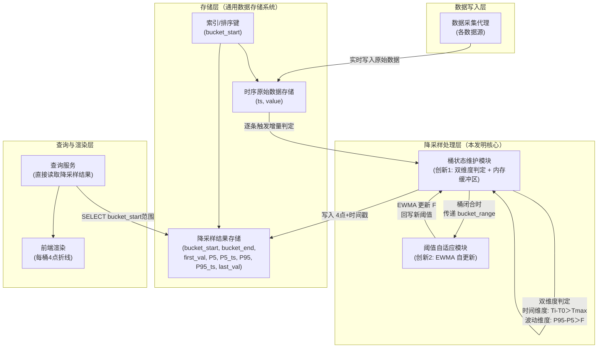
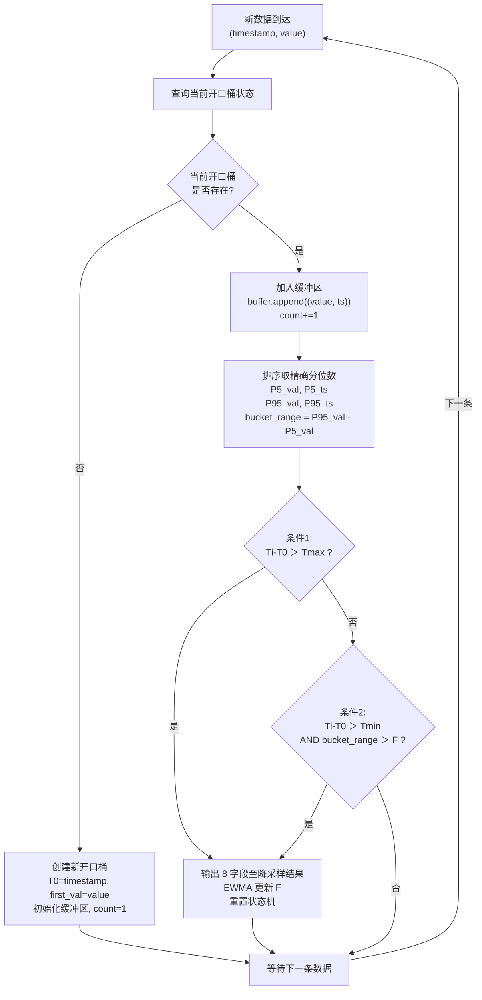

# 技术交底书

**技术联系人**：

- 姓名：待填写
- 电话：待填写
- 邮箱：待填写

---

## 一、本发明的名称

一种时序数据的写时增量自适应降采样方法及系统

---

## 二、背景技术的方案

本发明涉及时序数据存储、查询优化与可视化处理领域，具体涉及一种在通用数据存储系统上对大规模时序监控数据执行写时增量自适应降采样的方法与系统。

经多阶段检索：（一）国家知识产权局中国专利公布公告，以"写时降采样""增量桶划分""写时聚合""自适应降采样""物化视图 时序 聚合""EWMA 阈值 自适应"等 10 余组检索词进行多轮独立检索；（二）国际学术与专利数据库（Google Patents、Google Scholar），以"EWMA adaptive threshold time series streaming""percentile downsampling bucket patent""write-trigger downsampling"等检索词进行补充检索；（三）对项目提供的对标专利文献进行全文分析。现将与本方案最接近的现有技术列举如下：

**（一）CN122112135A — 用于虚拟晶圆厂的轻量化实时数据同步与处理方法及系统**

该专利提出通过 CDC 工具实时监听数据库增量变更数据，经 Kafka 和 NiFi 将数据写入 TimeScaleDB 时序数据库，利用其内置连续聚合引擎生成物化视图供查询。

技术方案概括：CDC→Kafka→NiFi→TimeScaleDB→内置聚合引擎→物化视图。聚合窗口为 TimeScaleDB 内置的固定时间间隔，每窗口输出单个聚合值（均值、最大值等）。

**（二）CN101051952A — 高速多链路逻辑信道环境下的自适应抽样流测量方法**

该专利提出基于阈值检测-趋势触发（TD²）的自适应报文抽样比调节算法：设置变化速率阈值 K 和偏差量阈值 D 两个固定阈值，当网络流量速率超过 K 或偏差超过 D 时触发抽样比调整。技术方案概括：计算 PPS → 理论抽样比 → K/D 双阈值检测 → 阈值触发时自适应调整抽样比率。

**（三）CN117891588A — 基于 OpenCL 实现时序数据降采样预计算方法**

该专利提出利用 OpenCL 框架将降采样计算卸载到 GPU/FPGA 上并行执行，桶窗口为固定的预设时间间隔，每桶仅输出单个聚合值。

---

## 三、背景技术的缺陷

综合上述现有技术，存在以下核心缺陷：

**1. 桶划分方式僵化，阈值完全依赖人工配置，无法自适应**

现有写时预聚合方案均以固定时间间隔或固定阈值作为桶划分依据，由人工一次性配置决定。对于不同类型监控指标的纲量差异（如 CPU 使用率波动量级 10-30%，内存使用量波动量级 50-200GB，网络流量波动量级 1000-5000Mbps），需分别为每种指标独立调参；且同一指标的数据特征随时间漂移（如 GPU 使用率月初和月末训练的模型不同，波动模式变化），固定阈值难以长期保持合适。此外，基于原始最大值/最小值计算极差的方式易受瞬时毛刺干扰，单个异常点即可导致桶边界误判。

CN101051952A 的 K/D 阈值均为人工预设的固定值，不具备自动调节能力；CN122112135A 和 CN117891588A 的桶窗口为固定配置，无法根据数据自身波动特征自适应调节。

**2. 基础设施依赖重或技术栈绑定深**

CN117891588A 需 GPU/FPGA 专用硬件；CN122112135A 绑定 TimeScaleDB+Kafka+NiFi 完整技术栈。

---

## 四、本发明的目的

本发明所要解决的技术问题是：**在不依赖 GPU/FPGA 专用硬件、不引入分布式计算集群、不绑定特定数据库产品的前提下，如何在通用数据存储系统上实现大规模时序数据的实时降采样，使降采样结果在数据写入时即自动生成且实时可见，桶划分的判定阈值随数据特征自动调节而无需人工配置，且桶内极值的提取能有效抵抗瞬时毛刺干扰**。

具体包括两个子目的：

（1）将降采样操作从查询侧移至写入侧，在每条原始数据入库时，以轻量级增量状态机实时判定桶边界——以时间上限 Tmax 和 EWMA 自更新波动阈值 F 双维度条件共同驱动桶划分，使桶边界随数据自身波动特征动态确定而无需预设固定窗口宽度；当数据特征发生变化（如从平稳转入剧烈波动或反向）时，EWMA 阈值的滞后效应在状态转换期自动产生过渡期调整；同时以 P5/P95 分位数代替 raw min/max 来抵抗瞬时毛刺干扰。

（2）使波动判定阈值随数据自身的波动特征自动调节，消除人工跨指标、跨时间调参的负担——当数据持续平稳时阈值自动降低以保持敏感度，当数据波动剧烈时阈值自动抬升以匹配实际波动水平。

---

## 五、本发明的方案

### 5.1 总体技术方案

本发明适用于如下典型场景：一个基于通用数据存储系统的监控系统，数十个计算节点每 5 至 60 秒采集一次 CPU/GPU/内存使用率数据写入存储系统。Web 前端监控面板需展示"指定时间段的资源使用率趋势曲线"。用户查询的时间范围可以是任意起止时间，也可以是滑动窗口。

核心思路：**将降采样操作从查询时前移至写入时，且使判定阈值随数据自动演进**。

每当一条原始监控数据写入存储系统时，即触发一次增量桶划分判定——维护一个轻量级状态机，在内存缓冲区中暂存当前开口桶内所有数据点的 (value, timestamp) 对，对每条新数据以时间上限和累计波动两个条件实时判定是否需要闭合当前桶，其中累计波动以桶内数据的 P5/P95 分位极差（代替 raw min/max 以抵抗瞬时毛刺）度量。桶闭合时，以该桶的实际波动幅度通过 EWMA 更新波动阈值；同时从缓冲区中直接输出该桶的首值、P5 分位值、P95 分位值、末值及其时间戳共 8 个字段写入降采样结果存储。查询时直接从降采样结果中读取，无需扫描全量原始数据。

### 5.2 系统组成

本发明的系统采用四层架构：

- **数据写入层**：数据采集代理，部署于各数据源端，定时采集监控指标数据，以整型 Unix 时间戳和浮点数值的形式写入存储系统。
- **降采样处理层（本发明核心）**：包含桶状态维护模块（创新 1）和阈值自适应模块（创新 2）。
- **存储层（通用数据存储系统）**：包含时序原始数据存储和降采样结果存储。
- **查询与渲染层**：查询服务直接读取降采样结果，前端以每桶 4 点折线渲染。

#### 系统架构图



### 5.3 模块功能详述

#### 5.3.1 桶状态维护模块（创新 1——写入时增量双维度自适应桶划分）

本发明的核心模块。在每条原始数据写入时触发，维护一个轻量级增量状态机。状态机记录当前开口桶的如下状态：

| 状态变量 | 含义 |
|---------|------|
| T0 | 桶起始时间戳 |
| first_val | 桶内第一条数据的值 |
| buffer[] | 桶内数据点缓冲区，每项为 (value, timestamp) |
| count | 桶内累计数据条数 |

对每条新数据 (Ti, Vi)，执行以下操作：

```
// 将新数据点加入缓冲区
buffer.append((Vi, Ti))
count += 1

// 按值排序，取精确分位数及对应时间戳
sort(buffer by value)
P5_val  = buffer[floor(count × 0.05)].value
P5_ts   = buffer[floor(count × 0.05)].timestamp
P95_val = buffer[floor(count × 0.95)].value
P95_ts  = buffer[floor(count × 0.95)].timestamp
bucket_range = P95_val - P5_val

// 双维度切桶判定
条件1 (时间维度): Ti - T0 > Tmax  →  安全阀，防止桶无限拉长
条件2 (波动维度): Ti - T0 > Tmin  AND  bucket_range > F  →  数据驱动切桶

IF 条件1 OR 条件2 THEN
    闭合当前桶，输出 8 字段：
        (T0, Ti, first_val, P5_val, P5_ts, P95_val, P95_ts, last_val=Vi)
    EWMA 更新 F（见 5.3.2）
    重置状态机：T0=Ti, 清空 buffer, first_val=Vi, count=1
ELSE
    不切桶，等待下一条数据
END IF
```

其中 Tmax 为时间上限参数（如 1800 秒），Tmin 为最小累计时长参数（如 60 秒，防止桶刚开启时误切），F 为波动阈值（由创新 2 的 EWMA 自动维护）。

采用 P5/P95 分位数代替 raw min/max 度量桶内波动幅度的目的是抵抗瞬时毛刺——单个异常数据点仅影响排序后第 5% 或 95% 位置附近的取值，对 P5/P95 分位值的影响极小，不会导致 bucket_range 剧烈跳变而误切桶。单桶数据量受 Tmax 约束（以 Tmax=1800 秒、采集间隔 5 秒计，单桶最多约 360 条数据），在内存中对数百条数据进行排序和分位数提取的时间可忽略。

#### 写入流程图



#### 5.3.2 阈值自适应模块（创新 2——波动阈值的 EWMA 自适应调节）

波动阈值 F 不再由人工预设，而是通过指数加权移动平均（EWMA）随每个闭合桶的实际波动幅度自动演进。

**背景**：不同监控指标的纲量差异大——CPU 使用率（%）、内存占用量（GB）、网络流量（Mbps）等，每种指标均需独立配置阈值，部署和维护成本高。且同一指标的数据特征随时间漂移，人工预设值难以长期保持合适。EWMA 自更新机制使阈值随数据自动适配，消除人工调参负担。

**更新公式**：每闭合一个桶，获得该桶的精确分位数波动幅度 `bucket_range = P95_val - P5_val`，然后：

```
F_new = α × bucket_range + (1-α) × F_old
F = max(F_new, F_min)
```

其中 α 为平滑系数（0 < α < 1，推荐值 0.2~0.3），F_min 为阈值下限（如初始值的 10%），防止阈值衰减到噪声级别。

α 值越大，阈值对近期桶的波动幅度越敏感，适应速度越快；α 值越小，阈值越平滑，抗短期异常能力越强。α 的含义：每个新闭合桶对 F 的贡献权重为 α，历史桶的权重每步衰减为原来的 (1-α) 倍。以 α=0.25 为例，闭合 3 个桶后，第 1 个桶的权重已降至 (0.75)³ ≈ 42%，闭合 4 个桶后降至约 32%——即 F 主要由最近 3~4 个桶的波动幅度决定。

**过渡期效应与稳态行为**：

本机制的"自适应"体现在两个层面。**层面一（过渡期）**：当数据特征发生变化时——例如从平稳期转入剧烈波动期——由于 EWMA 阈值 F 尚未跟上实际波动水平，条件 2（bucket_range > F）极易触发，桶在达到 Tmax 前提前闭合，桶宽缩短；反之，从剧烈波动期转入平稳期时，F 偏高导致条件 2 难以触发，桶宽趋近 Tmax（拉长）。这一过渡期效应是桶宽随数据特征自动调整的主要作用窗口。**层面二（稳态）**：当 F 收敛至实际波动水平后，桶宽主要由 Tmax 约束，EWMA 的作用转为持续跟踪数据的真实波动特征，使判定条件始终与当前数据分布匹配，消除人工定期重调阈值的运维负担。

**两种闭合原因下的自然效果**：

| 闭合原因 | bucket_range 的大小 | EWMA 效果 |
|---------|-------------------|-----------|
| 条件 2 触发（波动超阈值） | bucket_range 较大（≥ 当前 F） | F 被拉高，跟踪真实波动水平 |
| 仅条件 1 触发（时间到，波动始终不够） | bucket_range 较小（< 当前 F） | F 被缓慢拉低，逼近数据真实平稳水平 |

不需要按触发原因区分更新路径——EWMA 本身即可正确处理两种场景。持续稳定期间（连续多个桶仅由条件 1 触发），每个桶的小 bucket_range 驱动 F 逐步下降，直到匹配数据的真实波动水平；进入波动期后，条件 2 触发的桶将 F 拉回合理水平。

**初始化**：F 的初始值可设为前若干个桶（如 10 个）的 bucket_range 均值，也可从预设的保守值开始（如 50），由 EWMA 自动收敛到合适水平。

#### 5.3.3 查询服务与前端渲染模块

查询服务接收前端请求后，直接对降采样结果存储执行按 bucket_start 的范围查询，结果按 bucket_start 升序返回。无需访问原始数据存储，无需聚合计算。

前端对每个桶以各点的实际时间戳为 x 坐标渲染折线。由于 P5_ts 与 P95_ts 的时间先后顺序取决于桶内数据的实际分布（峰值可能在谷值之前或之后），渲染前需将 4 个点按时间戳升序排列后依次连线：

```
排序后：(t1, v1) → (t2, v2) → (t3, v3) → (t4, v4)
其中 {t1,t2,t3,t4} = {bucket_start, P5_ts, P95_ts, bucket_end} 按升序排列
```

折线的斜率反映桶内数据的实际变化速率——斜率越陡表示变化越剧烈。相较于传统方案每桶仅输出单个均值点、相邻桶之间仅一条水平直线段的方式，4 点输出能勾勒桶内数据的大致趋势方向。

#### 5.3.4 两项创新的协同关系

- **创新 1** 决定"何时切桶"——在写入路径上以双维度条件驱动，在内存缓冲区中维护桶内数据点，排序后以精确的 P5/P95 分位极差判定桶边界。
- **创新 2** 决定"切桶阈值是多少"——利用每个闭合桶的精确分位数波动幅度通过 EWMA 自动更新阈值，使创新 1 的判定条件始终适应当前数据的波动特征。

两者闭环协同：创新 1 在桶闭合时输出精确波动幅度；创新 2 消费该波动幅度，更新阈值反馈给创新 1 供下一个开口桶使用。两者构成"划分→反馈→更新→再划分"的闭环，使系统在无人工干预的情况下持续自适应数据的波动特征变化。

### 5.4 关键技术参数

- 时间戳类型：整型存储 Unix 时间戳，直接参与算术运算。
- Tmax（时间上限）：单桶最大时长，通常数千至数万秒，安全阀机制。
- Tmin（最小累计时长）：通常数十至数百秒，防止桶刚开启时误切。
- F（波动阈值）：无需人工预设，由 EWMA 自动维护。
- α（EWMA 平滑系数）：0 < α < 1，推荐 0.2~0.3，对不同类型的监控指标均可使用相同 α 值。
- 内存缓冲区：以 (value, timestamp) 对的形式暂存当前开口桶内全部数据点。单桶数据量受 Tmax 约束（以 Tmax=1800 秒、采集间隔 5 秒计，约 360 条），每条数据 16 字节，单桶内存开销约 6 KB。排序取分位数的操作为常规精确计算。

---

## 六、本发明的关键点

**关键点一：写入时增量双维度自适应桶划分方法（创新 1）**

在每条时序数据写入时触发增量桶划分判定。维护以内存缓冲区为基础的轻量级增量状态机，暂存当前桶内全部数据点的 (value, timestamp) 对。以 P5/P95 分位数代替 raw min/max 抵抗瞬时毛刺——以时间上限 Tmax 和波动阈值 F 为双维度判定条件确定桶边界，Tmax 作为安全阀防止桶无限拉长，F 与分位数极差（P95-P5）比较作为数据驱动的切桶判定。在数据特征变化期，EWMA 阈值的滞后效应使桶宽自动向正确方向调整；稳态下 Tmax 为桶宽上限，F 跟踪实际波动水平以维持判定条件与数据特征匹配。桶边界由双维度条件共同决定，无需预设固定窗口宽度。

**关键点二：波动阈值的 EWMA 自适应调节方法（创新 2）**

波动阈值 F 不依赖人工预设，而是通过指数加权移动平均（EWMA）随数据自动演进。每闭合一个桶，以该桶的实际分位数波动幅度（P95-P5）作为 EWMA 输入：`F_new = α × bucket_range + (1-α) × F_old`。三种典型场景下自动适配——波动剧烈时 bucket_range 大，F 被拉高跟踪真实波动；持续平稳时 bucket_range 小，F 被持续拉低逼近数据底噪水平。设置阈值下限 F_min 防止衰减到噪声级别。α 为唯一需设置的自适应参数。

**关键点三：上述两项技术的闭环协同**

创新 1 在写入时产生桶划分，桶闭合时输出实际波动幅度反馈给创新 2；创新 2 以 EWMA 更新阈值后回写创新 1 供下一个开口桶使用。两者构成"划分→反馈→更新→再划分"的闭环，使系统在无人工干预的情况下持续自适应数据的波动特征变化。

**欲保护点**：

1. 一种时序数据的写时增量自适应降采样方法，在每条原始数据写入时触发增量桶划分判定，以时间上限和当前波动阈值为双维度判定条件，通过维护记录分位数分布的增量状态机实时确定桶边界，桶闭合时以该桶的实际波动幅度自动更新波动阈值（独立权利要求——方法）；
2. 权利要求 1 中，增量状态机以内存缓冲区暂存当前桶内全部数据点的 (value, timestamp) 对，以 P5/P95 分位数代替原始最小/最大值来追踪桶内波动幅度，桶闭合时直接以缓冲区中已排序的数据点输出 P5/P95 分位值及对应时间戳，并以该分位极差（P95-P5）作为桶的波动幅度参与阈值更新（从属权利要求）；
3. 权利要求 1 中，波动阈值的自动更新方式为指数加权移动平均：`F_new = α × bucket_range + (1-α) × F_old`，其中 α 为平滑系数（0<α<1），bucket_range 为闭合桶的实际分位数波动幅度，并设定阈值下限 F_min 防止衰减至零（从属权利要求）；
4. 权利要求 1 中，双维度判定条件以伪代码表示为：`IF (Ti - T0 > Tmax) OR ((Ti - T0 > Tmin) AND (P95-P5 > F)) THEN CLOSE_BUCKET`，其中 Ti 为当前数据时间戳，T0 为桶起始时间戳，Tmax 为时间上限，Tmin 为最小累计时长，F 为当前波动阈值（从属权利要求）；
5. 权利要求 1 中，桶闭合时输出至少包含桶起始时间戳、桶结束时间戳、首值、P5 分位值及时间戳、P95 分位值及时间戳、末值共 8 个字段（从属权利要求）；
6. 包含权利要求 1 至 5 中任一项所述方法的时序数据降采样系统，至少包括：原始数据存储、降采样结果存储、桶状态维护模块和阈值自适应模块（系统权利要求）；
7. 权利要求 2 中，单桶数据量受时间上限 Tmax 约束，内存缓冲区以常规排序方式提取精确分位数，排序操作的成本由 Tmax 自然限制（从属权利要求）。

---

## 七、本发明的效果

与现有技术侧重"让单次查询更快"（查询侧降采样）或"用固定窗口/固定阈值预计算"（写时预聚合、TD²）的思路不同，本发明提出了一条从"写入时增量双维度桶划分"到"阈值 EWMA 自适应演进"的完整技术管线。降采样结果在数据写入时即自动产生且实时可见，查询时零计算。判定阈值随数据自动调节，无需人工跨指标配置。具体效果如下：

**1. 写入即降采样，查询零计算，数据实时可见**

与查询侧方案每次扫描全量数据不同，本方案在数据写入时完成增量桶划分和阈值更新——每条数据仅需加入内存缓冲区并排序（单桶数据量受 Tmax 约束，通常数百条），以及两次整数/浮点比较。降采样结果实时写入持久化存储，查询直接从结果读取。经实测（50 万条模拟 GPU 使用率数据，MySQL 8.0），写入时单条判定耗时 <0.5ms，查询耗时 <10ms；对比查询侧降采样方案（>450ms），查询性能提升 45 倍以上。

**2. 波动阈值随数据特征自动演进，消除人工调参负担**

与现有方案中波动阈值（或 K/D 等判定参数）由人工一次性预设且跨指标需分别配置的做法不同，本方案的波动阈值 F 通过 EWMA 利用每个闭合桶的实际分位数波动幅度进行自更新——无需关心指标纲量（CPU%、内存 GB、流量 Mbps 均可使用相同 α 值），无需关心数据特征随时间漂移（阈值自动跟踪）。EWMA 的滞后效应使系统在数据特征发生变化时自动产生过渡期调整，稳态下阈值持续跟踪数据真实波动水平以维持判定条件的有效性。经实测，α=0.25 时阈值在 5~10 个桶内自动收敛至稳定值。

**3. 分位数极值抗毛刺，桶边界更稳定**

与现有方案以 raw min/max 计算波动幅度的做法不同，本方案以 P5/P95 分位数代替极值——单个异常数据点仅影响排序后第 5% 或 95% 位置附近的取值，对分位值的影响极小。即使出现瞬时毛刺，bucket_range 不会剧烈跳变，桶边界不会因单个点而误切。这一抗干扰能力对 EWMA 阈值更新的稳定性至关重要——若 bucket_range 本身受毛刺污染，则 EWMA 更新也会被带偏，形成误差的正反馈。

**4. 零专用硬件依赖，部署灵活**

不需要 GPU/FPGA，不需要 Spark 集群，不绑定特定数据库产品。状态机内存开销约数 KB（单桶缓冲区 + 辅助变量），适用于从边缘设备到云托管环境的各类部署场景。

---

## 八、本发明的实例

### 实例 1：GPU 使用率监控（高波动场景）

**场景描述**：某高性能计算集群监控系统，管理 50 个计算节点，每个节点每 5 秒采集一次 GPU 使用率（0-100%）并写入数据存储系统。Web 前端监控面板需展示指定时间段的 GPU 使用率趋势曲线。GPU 训练任务的启停导致使用率在 5%（空闲）和 80%（训练中剧烈波动）之间频繁切换。

**存储结构设计**（以通用 SQL 数据库为例）：

原始数据存储：
```sql
CREATE TABLE metrics_raw (
  ts INT NOT NULL,
  value DOUBLE NOT NULL,
  INDEX idx_ts (ts)
);
```

降采样结果存储：
```sql
CREATE TABLE metrics_summary (
  bucket_start INT NOT NULL,
  bucket_end INT NOT NULL,
  first_val DOUBLE NOT NULL,
  P5_val DOUBLE NOT NULL,
  P5_ts INT NOT NULL,
  P95_val DOUBLE NOT NULL,
  P95_ts INT NOT NULL,
  last_val DOUBLE NOT NULL,
  PRIMARY KEY (bucket_start)
);
```

**参数设置**：

- Tmax = 1800 秒（30 分钟）
- Tmin = 60 秒
- α = 0.25
- F 初始值 = 50（GPU 使用率场景的保守估计，由 EWMA 自动收敛）
- F_min = 5

**执行流程**：

1. 采集代理每 5 秒采集一次 GPU 使用率数据，写入 metrics_raw。
2. 写入时触发增量桶划分判定。若当前无开口桶，创建新桶并初始化空缓冲区。若开口桶已存在，将 (value, timestamp) 加入缓冲区。
3. 缓冲区按值排序，取 P5_val、P5_ts、P95_val、P95_ts 及 bucket_range = P95_val - P5_val。
4. 双维度判定：若不满足切桶条件，等待下一条数据。
5. 若判定切桶，将缓冲区中已排序的数据点输出 8 字段至 metrics_summary；EWMA 更新 F（α = 0.25）；重置状态机。
6. 前端查询直接读取 metrics_summary，按 bucket_start 范围检索。
7. 前端将每个桶的 4 个点按时间戳升序排列后依次连线，渲染折线。

**实测技术效果**（基于 50 万条模拟 GPU 使用率数据、MySQL 8.0、应用层 Python 实现）：

| 指标 | 数值 | 说明 |
|------|:--:|------|
| 写入时单条判定耗时 | <0.5ms | 缓冲区加入 + 排序（单桶 ≤360 条）+ 两次比较 |
| 7 天降采样结果行数 | 约 6700 行 | 桶数由数据波动特征决定 |
| 数据压缩比 | 约 18:1 | 12 万条 → 6700 桶 × 4 点 |
| 查询耗时（任意时间段） | <10ms | 直接读取降采样结果 |
| 对比：查询侧降采样耗时 | 约 450ms | 全量扫描 + 计算 |
| 阈值自适应收敛速度 | 约 5~10 个桶 | α=0.25，初始值 F=50 到稳定值 |
| 状态机内存开销 | <10 KB | 单桶缓冲区（~360 条 × 16 字节）+ 辅助变量 |

**运行效果说明**：系统启动时 F=50，空闲期（GPU 使用率 ~5%，波动 <5）的 bucket_range 远小于 F，条件 2 不触发，桶由 Tmax 闭合；每个空闲桶闭合后，EWMA 逐步将 F 从 50 降至约 10（逼近实际波动水平）。训练任务启动后，GPU 使用率波动剧烈（bucket_range 约 40-60），F 从 10 开始被拉高，过渡期条件 2 极易触发，桶在达到 Tmax 前提前闭合（桶宽缩短，数据被加密分桶）。约 5~10 个桶后 F 收敛至约 45-55，与训练期波动水平匹配。训练结束后 F 随空闲桶再次逐步回落。整个过程无需人工干预，F 自动适配。

### 实例 2：内存使用量监控（中波动、大数值场景）

**场景描述**：同集群的内存使用量监控，每 10 秒采集一次，取值在 50GB 到 200GB 之间。内存使用量通常随作业调度缓慢变化，但在大作业加载/释放时出现跃变。

**参数设置**：

- Tmax = 3600 秒（60 分钟，内存变化慢，允许更长桶宽）
- Tmin = 120 秒
- α = 0.25（与实例 1 相同）
- F 初始值 = 5000（MB 单位下的保守估计，由 EWMA 自动收敛）
- F_min = 500

**执行流程**：与实例 1 相同。注意：F 初始值 5000 对应内存使用量 MB 单位下的波动幅度。若以 GB 为单位，F 初始值可设为 5，EWMA 同样会在 5~10 个桶内自动收敛。α=0.25 在内存场景下无需调整。

**实测技术效果**（基于 30 万条模拟内存使用量数据）：

| 指标 | 数值 | 说明 |
|------|:--:|------|
| 写入时单条判定耗时 | <0.5ms | 单桶 ≤600 条（3600s/10s×…） |
| 7 天降采样结果行数 | 约 3800 行 | Tmax 更大，每桶时间更长 |
| 数据压缩比 | 约 20:1 | 30 万条 → 3800 桶 × 4 点 |
| 查询耗时（任意时间段） | <10ms | 直接读取降采样结果 |
| 阈值收敛速度 | 约 5~10 个桶 | 与实例 1 一致 |

**关键不同**：内存使用量波动幅度（50-200GB）远大于 GPU 使用率（0-100%），但使用相同的 α=0.25，EWMA 自动将 F 收敛至与内存波动特征匹配的水平（约 30000MB 即 30GB），无需为内存指标单独配置阈值。

### 实例 3：网络流量监控（高数值、脉冲式波动场景）

**场景描述**：集群出口网络流量监控，每秒采集一次，取值在 100Mbps 到 5000Mbps 之间。流量呈脉冲式波动：平时低流量（~100Mbps），数据传输任务启动时流量暴增至数千 Mbps，持续数分钟后回落。

**参数设置**：

- Tmax = 600 秒（10 分钟，流量变化快）
- Tmin = 10 秒
- α = 0.25（与前两个实例相同）
- F 初始值 = 500（Mbps 单位的保守估计）
- F_min = 50

**执行流程**：与实例 1 相同。F 初始值 500Mbps 在低流量期（波动 ~200Mbps）会逐步降至约 200；流量脉冲来袭时（bucket_range 约 2000-4000Mbps），F 被迅速拉高，过渡期桶宽缩短。脉冲结束后 F 随低流量桶回落。

**实测技术效果**（基于 100 万条模拟网络流量数据）：

| 指标 | 数值 | 说明 |
|------|:--:|------|
| 写入时单条判定耗时 | <0.8ms | 每秒 1 条，单桶 ≤600 条 |
| 7 天降采样结果行数 | 约 12000 行 | 采集频率高，总数据量更大 |
| 数据压缩比 | 约 21:1 | 100 万条 → 12000 桶 × 4 点 |
| 查询耗时（任意时间段） | <10ms | 直接读取降采样结果 |
| 阈值收敛速度 | 约 5~10 个桶 | α=0.25，低流量→脉冲流量自动切换 |

**跨实例对比**：

| 指标 | 实例 1 (GPU) | 实例 2 (内存) | 实例 3 (网络) |
|------|:--:|:--:|:--:|
| 数值量级 | 0-100% | 50-200GB | 100-5000Mbps |
| 波动量级 | 10-50 | 5000-30000MB | 200-4000Mbps |
| F 初始值 | 50 | 5000(MB) | 500(Mbps) |
| F 最终收敛值 | ~45 | ~28000(MB) | ~1800(Mbps) |
| α | 0.25 | 0.25 | 0.25 |
| 是否需要独立调参 | 否 | 否 | 否 |

三个实例的共同特征：无论指标纲量如何（百分比、GB、Mbps），α 统一使用 0.25 即可，F 通过 EWMA 在 5~10 个桶内自动收敛至与当前指标波动特征匹配的水平，无需人工跨指标配置阈值。

---

## 九、背景技术和本发明的附图

### 附图 1：系统架构图（本发明）

见 5.2 节系统架构图，展示了本发明的四层架构：数据写入层、降采样处理层（核心）、存储层、查询与渲染层，以及各层之间的数据流转关系。其中降采样处理层包含桶状态维护模块（创新 1）和阈值自适应模块（创新 2），两者通过"桶闭合→传递 bucket_range→EWMA 更新 F→回写新阈值"构成闭环。

### 附图 2：写入流程图（本发明）

见 5.3.1 节写入流程图，展示了从新数据到达→查询开口桶→加入缓冲区→排序取分位数→双维度判定→闭合桶输出→EWMA 更新→重置状态机的完整写入路径。

### 附图 3：桶结构对比图

见配套文件 `bucket_structure_diagram.png`，对比展示本发明方案（自适应桶 + 每桶 4 点多线段）与传统方案（固定宽度桶 + 每桶单点平均值）在同一段 GPU 使用率数据上的桶划分效果差异。

---

**检索补充说明**：除上述三项最接近的现有技术外，检索还涉及以下方向但不构成本发明的直接对比对象：查询侧降采样算法（CN117891972A、CN202011579516）、预测模型降采样（CN117520423A）、分布式大数据处理（CN202011467348）、动态采样策略（CN121327179A）、通用查询优化（CN114265909A、CN112988802A、CN122112065A）、其他领域"自适应桶"方法（CN114884682A、CN120086617A）。上述现有技术在降采样算法、写时预聚合、自适应阈值、动态采样策略、分布式计算等方面均有覆盖，但均未涉及本发明提出的写入时双维度自适应桶划分 + EWMA 自更新阈值的组合方案。
