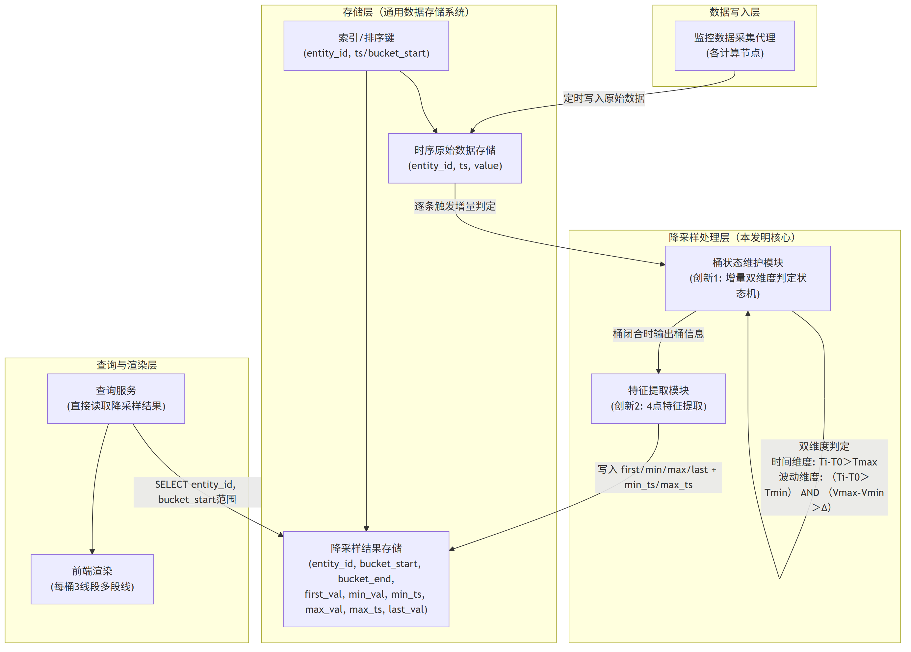
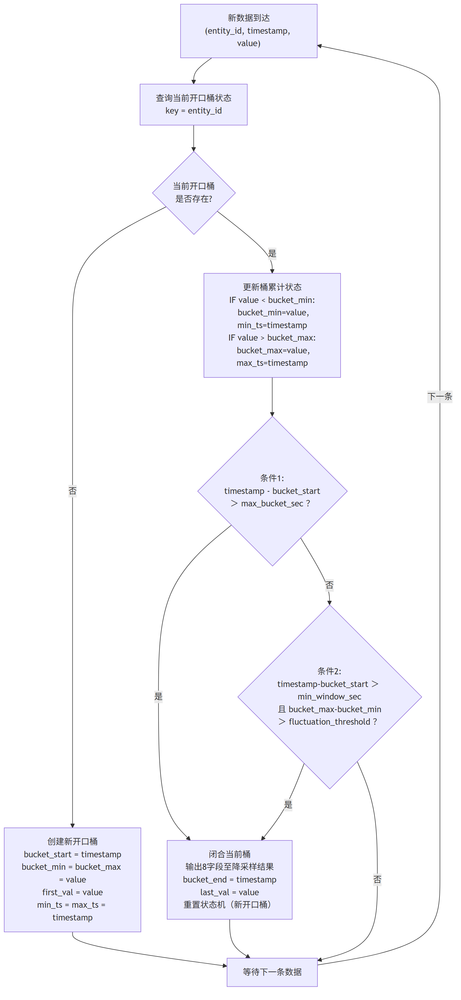

# 技术交底书

**案件名称**：一种面向关系型数据库时序数据的自适应降采样与多线段趋势还原方法及系统

**技术联系人**：

- 姓名：待填写
- 电话：待填写
- 邮箱：待填写

**专利类型**：发明

---

## 注意事项

（1）交底书应使代理人能看懂，尤其是背景技术和详细技术方案，一定要写得全面、清楚、完整；
（2）技术的公开程度，应以本领域普通技术人员不需付出创造性劳动即可进行实施为准。
（3）在与代理人沟通时，对于代理人咨询的技术问题，应给予回答并认真讲解，并且按要求及时正确地补充相应技术材料。

---

## 一、介绍相关技术背景，描述与本发明技术最相近的现有技术，并说明该现有技术存在的缺点

### 1.1 现有技术

本发明涉及数据库查询优化与时序数据可视化处理领域，具体涉及一种在关系型数据库中对大规模时序监控数据执行自适应降采样与趋势还原的方法与系统。经检索国家知识产权局中国专利公布公告（检索工具：cnipa_epub_search.py，检索日期：2026-05-28），以及与项目相关的参考专利文献，现按技术方向分类列举如下：

---

**方向一：应用层降采样算法（特征点选择类）**

**（1）CN117891972A — 时序数据降采样方法、装置、电子设备及存储介质**

该专利提出一种基于滑动窗口的动态降采样策略选择方法：根据目标输出总量、滑动窗口容量和单个滑窗抽样阈值，动态计算连续-间隔抽样临界值，确定采用连续抽样或间隔抽样策略，在每个滑动窗口内选取目标抽样量的数据点。该方法属于应用层LTTB变体。

- 应用场景：通用时序数据可视化
- 局限性：需将全量数据加载到应用层内存进行选点计算，数十万条数据时网络传输开销和内存压力大；选点过程涉及排序操作，O(n log n)复杂度；每桶仅输出1个采样点，桶内趋势形态完全丢失；降采样为纯查询侧行为，每次查询均需重复扫描全量原始数据。
- 来源链接：http://epub.cnipa.gov.cn/patent/CN117891972A

**（2）CN202011579516 — LTTB+TimeGap混合算法**

该专利提出将LTTB（最大三角形面积算法）与TimeGap时间间隔策略混合的特征点选择降采样方法：通过计算每个数据点在前后桶之间的三角形面积权重选取代表性特征点。

- 局限性：需全量数据加载到内存；O(n log n)复杂度；每桶输出单个特征点，完全丢失桶内波动信息；降采样在查询时执行，每次查询重复计算。
- 来源：项目参考专利目录

---

**方向二：写时聚合（预计算降采样）**

**（3）CN117891588A — 基于OpenCL实现时序数据降采样预计算方法**

该专利提出针对RedisTimeseries时序数据库，利用OpenCL框架将降采样计算任务卸载到GPU/FPGA等异构硬件上并行执行：通过CompactionRule合并规则在数据写入时预计算降采样结果，桶窗口为固定的预设时间间隔。

- 应用场景：配备GPU服务器的Redis时序数据库环境
- 局限性：必须依赖GPU/FPGA硬件；需改造数据库内核；预计算桶窗口为固定间隔（如每小时一个桶），窗口划分由配置静态决定，无法根据数据自身波动特征自适应调节桶密度；无法用于MySQL/PostgreSQL等关系型数据库。
- 来源链接：http://epub.cnipa.gov.cn/patent/CN117891588A

---

**方向三：预测模型降采样**

**（4）CN117520423A — 一种时序数据降采样方法及装置**

该专利提出利用存量时序数据对多项式模型进行训练，得到采样数据预测模型：将采样时间点输入预测模型直接输出采样结果，无需对原始数据进行实际采样。

- 应用场景：趋势数据降采样、缺失时间段补全
- 局限性：结果为预测近似值而非精确统计值；需离线训练模型；模型倾向于平滑掉异常峰值，不适合异常检测场景。
- 来源链接：http://epub.cnipa.gov.cn/patent/CN117520423A

---

**方向四：分布式大数据处理**

**（5）CN202011467348 — PySpark+Pandas融合的时序数据处理**

该专利提出通过PySpark分布式计算引擎与Pandas本地处理的混合架构处理大规模时序数据：数据从数据库抽取到Spark集群，利用分布式计算能力进行降采样处理。

- 局限性：依赖Spark集群基础设施，单机不可用；网络IO成为瓶颈；架构重、运维成本高。
- 来源：项目参考专利目录

---

**方向五：数据库查询优化（通用）**

**（6）CN114265909A — 关系型数据库查询优化方法**

该专利提出对SQL语句的多表连接查询中的过滤条件进行等级评估，优化多表连接查询的执行顺序（谓词上拉/下推）。

- 局限性：聚焦于多表连接场景，不涉及降采样或时序聚合查询；未涉及索引结构设计与缓冲池利用。
- 来源链接：http://epub.cnipa.gov.cn/patent/CN114265909A

**（7）CN112988802A — 基于强化学习的关系型数据库查询优化方法**

该专利提出利用树卷积神经网络提取逻辑计划树特征，通过强化学习模型自动选择逻辑优化规则的应用顺序。

- 局限性：针对优化器执行计划选择，非降采样聚合方法；需大量训练数据。
- 来源链接：http://epub.cnipa.gov.cn/patent/CN112988802A

---

**检索总结**：

在国知局公布公告站以"时序数据降采样""写时聚合""自适应桶""时序数据增量聚合""GROUP BY优化"等检索词进行多轮独立检索，结合项目参考专利文献，共筛选出7篇与本案高度相关的现有技术。

现有技术在降采样算法（LTTB、多项式预测）、写时预聚合（GPU/OpenCL加速、固定窗口）、分布式计算（Spark）、通用查询优化方面均有覆盖，但存在三个系统性空白：
（1）写入侧的降采样方案（如CN117891588A）均采用固定时间窗口作为桶划分依据，桶粒度由人工配置决定，无法随数据波动特征自适应调整——平稳区域浪费桶配额，剧烈波动区域细节被压缩；
（2）现有方案每桶仅输出单个聚合值或单个特征点，桶内数据的上升-下降-反弹等趋势形态完全丢失；
（3）现有写入侧方案依赖GPU/FPGA专用硬件或需改造数据库内核，无法在仅具备CPU和标准关系型数据库的通用服务器上运行。

本发明的两项创新——写入时增量双维度自适应桶划分、桶内4点多线段趋势还原——分别填补了上述三个空白。

### 1.2 现有技术存在的缺点

综合上述现有技术分析，存在以下核心缺陷：

**（1）桶划分方式僵化，无法适应数据波动差异**：现有写时聚合方案的桶划分策略均以固定时间间隔（如每小时、每天）为窗口单位，由人工配置决定，与数据自身的波动特征完全无关。存在三类典型问题——其一，平稳区域（如GPU夜间空闲时段，使用率长期维持在2%-5%）按固定间隔仍产生大量冗余桶，浪费存储和查询资源；其二，剧烈波动区域（如GPU训练时段，使用率在短时间内从30%飙升至95%再回落至40%）受限于固定窗口宽度，桶内波动细节被压缩为单一聚合值而丢失；其三，基于相邻单点差值判定切桶的方案（见部分LTTB变体）仅对比前后两个数据点，易受瞬时毛刺干扰导致频繁无效切桶，桶边界不稳定。三者均无法依据数据自身的波动特征自适应调节桶密度。

**（2）每桶输出单点，桶内趋势形态完全丢失**：无论LTTB的特征点选择、简单平均值聚合，还是写时预聚合方案中的COUNT/SUM/AVG，每桶最终仅输出一个值。前端渲染时相邻两桶之间仅有一条直线段，桶内的上升-下降-反弹等趋势变化被完全抹平，极值点和拐点的视觉信息丢失。运维人员无法从降采样曲线中判断监控指标是否经历了瞬时尖峰或剧烈振荡。

**（3）基础设施依赖重或架构侵入性强**：方向一的查询侧降采样方案每次请求均需扫描全量原始数据并重新计算，高频刷新场景下数据库负载极高；方向二的写时预聚合方案需GPU/FPGA专用硬件或Spark分布式集群，增加基础设施成本和运维复杂度；方向四的分布式方案需将数据从数据库抽取至外部计算引擎，网络IO成为瓶颈。在仅具备CPU和标准关系型数据库的通用服务器或云托管数据库环境中，上述方案要么性能不足，要么无法直接运行。

---

## 二、针对上述缺点，说明本发明所要解决的技术问题

本发明所要解决的技术问题是：**在不依赖GPU/FPGA专用硬件、不引入分布式计算集群、不改造数据库内核的前提下，如何在标准关系型数据库上实现大规模时序监控数据的实时降采样，使降采样结果在数据写入时即自动生成且实时可见，桶划分密度随数据波动特征自适应变化，且降采样后的趋势曲线能完整保留原始数据的波动形态**。具体包括两个子问题：

（1）如何将降采样操作从查询侧移至写入侧，在每条原始数据入库时，以轻量级增量状态机实时判定桶边界——波动剧烈处自动加密分桶以保留峰值、拐点和瞬时突变等关键细节，平稳处自动拉长桶宽以合并冗余数据，且判定逻辑仅依赖时间上限和累计波动两个维度——**写入时增量双维度自适应桶划分**；

（2）如何在每桶仅保留极少数据点（如4个）的约束下，最大限度地还原桶内数据的升降趋势和极值特征，使得降采样后的曲线能够近似展示原始数据的趋势形态——**桶内4点多线段趋势还原**。

---

## 三、本发明技术方案的详细阐述

### 3.1 背景

本发明适用于如下典型场景：一个基于关系型数据库的监控系统，数十个计算节点每5至60秒采集一次CPU/GPU/内存使用率数据写入MySQL。Web前端监控面板需展示"指定节点指定时间段的资源使用率趋势曲线"，面板面向数十至上百用户同时展示。用户查询的时间范围可以是任意起止时间（如"2026-03-15 08:00 至 2026-03-20 18:00"），也可以是"最近7天"等滑动窗口。

选择在关系型数据库而非专用时序数据库（如InfluxDB、TimescaleDB）上实现，是因为业务场景中通常需要将监控数据与用户表、项目表等业务数据进行JOIN联表查询。专用时序数据库虽自带降采样能力（如连续查询、自动rollup），但联表查询能力弱。

本发明的核心思路是：**将降采样操作从查询时前移至写入时**。每当一条原始监控数据写入数据库时，即触发一次增量桶划分判定——维护一个轻量级状态机记录当前开口桶的起止时间、累计最小值和累计最大值，对每条新数据以时间上限和累计波动两个条件实时判定是否需要闭合当前桶并开启新桶。闭合的桶立即提取first_val、min_val、max_val、last_val四个特征点并写入降采样结果表。查询时直接读取降采样结果表，无需扫描全量原始数据，无需应用层缓存。

### 3.2 系统框图





### 3.3 模块功能说明

**（1）监控数据采集代理**：部署于各计算节点，定时采集CPU/GPU/内存等资源使用率数据，以整型Unix时间戳和浮点数值的形式写入数据库时序原始数据表。

**（2）时序原始数据表**：关系型数据库中的原始监控数据表。时间戳字段采用整型（INT UNSIGNED）存储Unix时间戳，而非DATETIME类型——整型时间戳可直接参与整数减法、DIV等运算，无需类型转换函数调用，避免函数调用导致索引失效。表上建有联合索引，字段顺序遵循"等值过滤列在前、范围过滤列次之"的原则，典型结构为`(实体标识, timestamp)`，支撑写入时按实体和时间定位当前开口桶的高效查询。

**（3）降采样结果表**：存储已闭合桶的降采样结果。每行对应一个已闭合的桶，包含字段：实体标识（如节点编号）、bucket_start（桶起始时间戳，INT UNSIGNED）、bucket_end（桶结束时间戳）、first_val（桶内首个值）、min_val（桶内最小值）、max_val（桶内最大值）、last_val（桶内末尾值）。表上建有联合索引`(实体标识, bucket_start)`，支撑任意时间范围的快速范围查询。

**（4）桶状态维护模块（创新1——写入时增量双维度自适应桶划分）**：本发明的核心模块。在每条原始数据写入时触发，维护一个轻量级增量状态机。状态机仅记录当前一个开口桶的三项状态：bucket_start（桶起始时间戳）、bucket_min（桶内累计最小值）、bucket_max（桶内累计最大值）。对每条新入库数据，执行双维度判定：

- 条件1（时间维度）：若"当前行时间戳 - bucket_start > max_bucket_sec"，则闭合当前桶，以当前行时间戳作为新桶起始；
- 条件2（波动维度）：若"当前行时间戳 - bucket_start > min_window_sec"且"bucket_max - bucket_min > fluctuation_threshold"，则闭合当前桶，开启新桶。

两个条件满足任一即执行切桶。闭合当前桶时，将状态机中累积的bucket_start、first_val、bucket_min、bucket_max以及当前行时间戳作为bucket_end、当前行值作为last_val一并提交给特征提取模块，然后以当前行数据重置状态机（bucket_start=当前行时间戳，bucket_min=bucket_max=当前行值）。若两个条件均不满足，则仅更新bucket_min和bucket_max（取最小值/最大值），不切桶。

**（5）特征提取模块（创新2——桶内4点多线段趋势还原）**：接收桶状态维护模块在桶闭合时输出的桶信息（bucket_start、bucket_end、桶内全部原始数据的时间戳和值的有序序列），从中提取4个特征值：first_val（桶内第一个数据点的值）、min_val（桶内最小值）、max_val（桶内最大值）、last_val（桶内最后一个数据点的值）。将4个特征值连同bucket_start、bucket_end和实体标识写入降采样结果表。

**（6）查询服务与前端渲染模块**：查询服务接收前端请求后，直接对降采样结果表执行范围查询：`SELECT bucket_start, bucket_end, first_val, min_val, max_val, last_val FROM bucket_summary WHERE node = ? AND bucket_start BETWEEN ? AND ? ORDER BY bucket_start`。结果直接返回前端，无需经过原始数据表。前端接收后，对每个桶以3条线段按固定水平位置连接4个特征点：`(bucket_start, first_val) → (bucket_start + width/4, min_val) → (bucket_start + 3×width/4, max_val) → (bucket_end, last_val)`，形成多段线趋势曲线。

### 3.4 系统流程说明

#### 3.4.1 写入流程（核心创新——增量双维度自适应桶划分）





**流程说明**：

**写入阶段**——每条原始数据入库时触发以下流程：

1. 新数据到达，携带实体标识（node）、时间戳（timestamp，Unix整型秒）和指标值（value）。
2. 以实体标识为key，查询该实体的当前开口桶状态。若该实体尚无开口桶（首次写入或上一个桶刚闭合），以当前数据创建新开口桶：设置bucket_start为当前时间戳，bucket_min和bucket_max均为当前值，记录first_val为当前值。流程结束，等待下一条数据。
3. 若开口桶已存在，首先更新桶的累计最小值和最大值：bucket_min取当前bucket_min与当前值中的较小者，bucket_max取当前bucket_max与当前值中的较大者。
4. 执行双维度切桶判定：
   - 条件1（时间维度上限）：若当前时间戳与桶起始时间戳之差超过max_bucket_sec，立即闭合当前桶——这是安全阀机制，防止平稳期一个桶无限拉长。
   - 条件2（波动维度阈值）：若当前时间戳与桶起始时间戳之差超过min_window_sec（最小累计时长，防止桶刚开启时因数据正常抖动而误切），且桶内累计极差（bucket_max - bucket_min）超过fluctuation_threshold（波动阈值），立即闭合当前桶——这是数据驱动的核心机制，波动剧烈处自动加密分桶。
   - 两个条件均不满足：不切桶，等待下一条数据。状态机仅维护三项数值（bucket_start、bucket_min、bucket_max），内存开销可忽略。
5. 闭合当前桶时执行以下操作：
   - 记录bucket_end为当前时间戳；
   - 记录last_val为当前值（或桶内最后一条数据的值）；
   - 将(bucket_start, bucket_end, first_val, bucket_min, bucket_max, last_val)写入降采样结果表；
   - 以当前数据重置状态机：bucket_start=当前时间戳，bucket_min=bucket_max=当前值，first_val=当前值。

**查询阶段**——前端发起查询时：

1. 查询服务接收请求，参数包括实体标识（如node="gpu_node_01"）、起始时间戳和结束时间戳；
2. 直接对降采样结果表执行范围查询，利用联合索引(实体标识, bucket_start)快速定位；
3. 对当前开口桶（即降采样结果表中尚不存在的最新桶），以当前系统时间作为临时bucket_end，从状态机中读取当前first_val、bucket_min、bucket_max以及最新一条原始数据值作为last_val，拼接到查询结果末尾；
4. 将降采样结果直接返回前端，全程无需扫描原始数据表，无需计算。

#### 3.4.2 两项创新的协同关系

两项创新在系统管线中按"写入侧→查询侧"的顺序协同工作：

- **创新1（写入时增量双维度自适应桶划分）**：决定"数据如何被分割、何时被分割"。在写入路径上，通过轻量级增量状态机（仅维护一个开口桶的三项状态）对每条新入库数据执行双维度判定，桶边界由数据自身波动特征实时驱动——波动剧烈处自动加密分桶，平稳处自动拉长桶宽。闭合的桶即时写入降采样结果表，使得查询侧可以直接读取已结构化的降采样数据。

- **创新2（桶内4点多线段趋势还原）**：决定"每个桶输出什么信息"。在桶闭合时，提取first_val、min_val、max_val、last_val四个特征点，以3条线段连接，在降采样的信息压缩约束下最大限度地保留桶内数据的上升-下降-反弹等趋势形态。

两者自洽且互补：创新1使得降采样结果在写入时即产生且实时可见，消除了查询时的重复计算开销，同时支持了任意时间段的灵活查询（不再局限于"最近N天"滑动窗口）；创新2使得每个桶的输出携带了趋势形态信息，降采样不再是简单的信息丢弃。两者组合构成一条完整的"写入即降采样→查询零计算→趋势形态保留"技术管线。

### 3.5 关键技术参数

**（1）时间戳类型**：原始数据表和降采样结果表中的时间戳字段均采用整型（INT UNSIGNED）存储Unix时间戳，而非DATETIME类型。原因：整型时间戳可直接参与整数减法、比较等运算，无需类型转换函数调用，确保索引有效。

**（2）降采样结果表索引结构**：联合索引`(实体标识, bucket_start)`。查询时的WHERE条件（实体标识 = ? AND bucket_start BETWEEN ? AND ?）完全命中索引前列，范围扫描天然有序输出。

**（3）自适应桶参数**：

- `max_bucket_sec`（时间上限）：单桶最大时长，通常设为数千至数万秒。作用：安全阀——防止平稳期（如GPU夜间空闲）一个桶拉得过长，确保降采样结果表中至少有一定数量的数据点供前端绘制。
- `fluctuation_threshold`（波动阈值）：桶内累计极差的阈值。当`bucket_max - bucket_min > fluctuation_threshold`且当前桶已持续超过min_window_sec时触发切桶。根据监控指标的特性定制——GPU使用率波动大时可设为40-80，CPU使用率波动小时可设为10-30，网络流量可根据实际带宽范围设定。
- `min_window_sec`（最小累计时长）：防止桶刚开启、仅累积了几条数据时就因正常抖动而误触发切桶。通常设为数十至数百秒。该参数确保波动触发切桶的判断基于一段连续区间的整体行为，而非单个瞬时值的变化。

**（4）4点提取与渲染**：每桶输出first_val、min_val、max_val、last_val共4个特征值。渲染时x坐标按桶时间轴等分为4个位置（起始、1/4、3/4、结束），y坐标依次为4个特征值，连接为3条线段。若查询范围内共N个桶，则前端绘制3N条线段，构成一条近似还原原始趋势的多段折线。

**（5）增量状态机的内存开销**：每个监控实体仅维护一个开口桶的三项状态（bucket_start、bucket_min、bucket_max，均为64位数值），内存占用约24字节/实体。对于50个节点规模的监控系统，状态机总内存不到2KB，可完全在应用层内存中维护，也可利用数据库会话变量实现。

**（6）适用数据库范围**：本方法仅依赖关系型数据库的基础能力（整型存储、联合索引、范围查询），与数据库内核无关。适用于MySQL (InnoDB)、PostgreSQL、MariaDB等主流关系型数据库。增量状态机可在应用层（Python/Java，推荐，性能更好）或数据库层（利用触发器/存储过程/会话变量）实现。

---

## 四、与现有技术相比，本发明具有哪些优点？

**总述**：与现有技术侧重"让单次查询更快"（查询侧降采样）或"用固定窗口预计算"（写时预聚合）的思路不同，本发明提出了一条从"写入时增量自适应桶划分"到"桶内趋势形态保留"的完整技术管线。降采样结果在数据写入时即自动产生且实时可见，查询时零计算、零等待。桶划分密度由数据自身波动特征驱动，无需人工配置。在保有关系型数据库JOIN能力的前提下，同时解决了系统吞吐量、数据新鲜度、视觉展示质量和基础设施依赖四个维度的问题。

**核心优点**：

**（1）写入即降采样，查询零计算，数据实时可见**：与查询侧降采样方案（方向一，每次查询需扫描全量原始数据并重新计算）和固定窗口写时预聚合方案（方向二，预聚合结果可能滞后）不同，本发明在每条原始数据入库时即触发增量桶划分判定。桶闭合后降采样结果立即写入结果表，数据写入与降采样同步完成。查询时直接从降采样结果表读取——无需扫描原始数据表、无需聚合计算、无需应用层缓存——查询耗时从数百毫秒降至数毫秒。同时，由于不再依赖滑动窗口的时间对齐和缓存策略，查询支持任意起止时间范围，不再局限于"最近N天"模式。

**（2）桶划分密度自适应数据波动，高保真还原且抗干扰**：与现有写时聚合方案以固定时间间隔（如每小时）为桶窗口的静态划分方式不同，本发明的桶边界由数据自身波动特征实时驱动——仅依靠时间上限（max_bucket_sec）、波动阈值（fluctuation_threshold）和最小累计时长（min_window_sec）三个可调参数，即可实现：波动剧烈区域（如GPU训练时段）自动加密分桶，精准留存峰值、拐点和瞬时突变；平稳区域（如GPU空闲时段）自动拉长桶宽合并冗余。以桶内累计极差而非相邻单点差值衡量波动幅度，有效过滤瞬时毛刺，桶边界更贴合真实业务波动规律。场景通用性高，适配CPU使用率、内存占用、网络流量、磁盘IO等各类时序监控指标，无需针对不同业务修改底层分桶逻辑。

**（3）每桶4点多线段渲染，桶内趋势形态以多线段近似保留**：与每桶输出单点（均值、特征点或LTTB采样点）的现有方案不同，本发明每桶输出4个特征点并以3条线段连接，能在降采样后的曲线上展示桶内数据的上升-下降-反弹等趋势变化，极值和拐点的视觉信息不会丢失。信息保留度远超现有方案，计算复杂度仍保持在O(n)。

**（4）零基础设施依赖，无架构侵入**：本方法仅需通用CPU服务器和标准关系型数据库，不需要GPU/FPGA专用硬件（区别于方向二CN117891588A），不需要Spark等分布式计算集群（区别于方向四），不需要将数据迁移至专用时序数据库，不需要部署Redis等外部缓存层（区别于原时间对齐方案）。可在现有业务数据库上直接部署，保有关系型数据库的JOIN联表查询能力。

**（5）输出为精确统计值而非预测近似值**：本方法提取的min_val和max_val为桶内数据的精确最小值和最大值，非模型预测生成的近似值（区别于方向三CN117520423A），不会因模型平滑效应丢失异常峰值，适用于异常检测、告警触发等对数据精度有要求的场景。

---

## 五、本发明的技术关键点和欲保护点是什么？

**技术关键点一：写入时增量双维度自适应桶划分方法（创新1）**

在每条时序监控数据写入数据库时，触发一次增量桶划分判定。维护一个仅记录当前开口桶三项状态（起始时间戳、累计最小值、累计最大值）的轻量级状态机，对每条新数据同时以时间维度和波动维度两个条件判定是否闭合当前桶——时间维度设定单桶最大时长上限（max_bucket_sec），防止平稳期桶无限拉长；波动维度以桶内累计极差（bucket_max - bucket_min）衡量局部波动幅度，超过预设阈值（fluctuation_threshold）且当前桶已持续超过最小累计时长（min_window_sec）时触发闭合。两个条件满足任一即闭合当前桶、提取特征点并写入降采样结果表，同时重置状态机开启新桶。桶边界完全由数据自身波动特征实时驱动，无需预设固定窗口宽度或窗口数量。

（具体实现见第三章3.4.1节）

**技术关键点二：桶内首-低-高-尾4点多线段趋势还原方法（创新2）**

对每个闭合的降采样桶，不以单个聚合值代表整个桶的数据，而是提取桶内按时间排序的首个值（first_val）、最小值（min_val）、最大值（max_val）、末尾值（last_val）共4个特征点，写入降采样结果表。前端以3条线段按固定水平位置（桶开始 → 桶1/4宽度处 → 桶3/4宽度处 → 桶结束）连接这4个点，形成一条在降采样精度下尽可能还原原始数据升降趋势的多段折线。

（具体实现见第三章3.4.1节）

**技术关键点三：上述两项技术的组合**——写入时增量双维度自适应桶划分作为前端（在写入路径上实时产生降采样结果），4点多线段趋势还原作为后端（在桶闭合时提取特征并写入结果表），两者协同构成完整的"写入即降采样→查询零计算→趋势形态保留"技术管线。降采样结果表本身即为物化视图，查询时直接读取无需计算。

**欲保护点**：

1. 一种时序数据自适应降采样方法，在每条原始数据写入时触发增量桶划分判定，以时间上限和累计波动为双维度判定条件，通过维护仅含当前开口桶状态的轻量级状态机实时确定桶边界，并将闭合桶的特征数据写入降采样结果表（独立权利要求——方法）；
2. 一种时序数据降采样桶内趋势还原方法，每桶提取first、min、max、last四点并以多线段渲染（独立权利要求——方法）；
3. 包含权利要求1和2所述方法的时序数据降采样查询系统，至少包括原始数据表、降采样结果表、桶状态维护模块和特征提取模块（系统权利要求）；
4. 权利要求1中，双维度判定具体为：条件1——当前时间戳与桶起始时间戳之差超过预设时间上限；条件2——当前时间戳与桶起始时间戳之差超过预设最小累计时长且桶内累计最大值与累计最小值之差超过预设波动阈值；两个条件满足任一即闭合当前桶（从属权利要求）；
5. 权利要求1中，状态机仅维护当前一个开口桶的起始时间戳、累计最小值和累计最大值三项状态，内存开销与监控实体数量呈线性关系（从属权利要求）；
6. 权利要求1中，闭合桶的特征数据包括桶起始时间戳、桶结束时间戳、首个值、最小值、最大值和末尾值，写入关系型数据库的降采样结果表（从属权利要求）；
7. 权利要求2中，前端渲染以3条线段连接4个特征点，线段端点位置分别为：桶起始时间戳处取首个值、桶起始时间戳加1/4桶宽度处取最小值、桶起始时间戳加3/4桶宽度处取最大值、桶结束时间戳处取末尾值（从属权利要求）。

---

## 六、其它

### 实施例

**应用场景**：某高性能计算（HPC）集群监控系统，管理50个计算节点，每个节点每5秒采集一次GPU使用率（百分比，0至100）并写入MySQL 8.0数据库。Web前端监控面板需展示"指定节点指定时间段的GPU使用率趋势曲线"，时间段由用户自由指定。面板面向30名运维人员同时使用。

**数据规模**：单节点7天积累约12万条原始数据记录；50个节点共计约600万条原始记录。自适应桶划分后单节点降采样结果表约数千至一万行（取决于数据波动程度）。

**数据库表设计**：

原始数据表：
```sql
CREATE TABLE gpu_metrics (
  id BIGINT PRIMARY KEY AUTO_INCREMENT,
  node VARCHAR(64) NOT NULL,
  timestamp INT UNSIGNED NOT NULL,
  gpu_usage FLOAT NOT NULL,
  INDEX idx_node_ts (node, timestamp)
);
```

降采样结果表：
```sql
CREATE TABLE gpu_metrics_summary (
  node VARCHAR(64) NOT NULL,
  bucket_start INT UNSIGNED NOT NULL,
  bucket_end INT UNSIGNED NOT NULL,
  first_val FLOAT NOT NULL,
  min_val FLOAT NOT NULL,
  max_val FLOAT NOT NULL,
  last_val FLOAT NOT NULL,
  PRIMARY KEY (node, bucket_start)
);
```

**系统流程**：

1. 采集代理每5秒采集一次GPU使用率数据，写入gpu_metrics表；
2. 写入时触发增量桶划分判定——以node为key查询当前开口桶状态。若开口桶不存在（首次写入或刚闭合），新建开口桶；若开口桶已存在，更新bucket_min/bucket_max，执行双维度判定；
3. 双维度判定参数：max_bucket_sec=15000秒（约4.17小时），fluctuation_threshold=45（GPU使用率波动阈值），min_window_sec=60秒；
4. 若判定切桶，提取first_val、min_val、max_val、last_val，连同bucket_start和bucket_end写入gpu_metrics_summary表；
5. 前端查询时，直接执行`SELECT bucket_start, bucket_end, first_val, min_val, max_val, last_val FROM gpu_metrics_summary WHERE node='gpu_node_01' AND bucket_start BETWEEN 起始时间戳 AND 结束时间戳 ORDER BY bucket_start`，查询耗时数毫秒；
6. 对于当前开口桶（最新桶，尚未闭合），以当前系统时间作为临时bucket_end，从状态机读取first_val、bucket_min、bucket_max，从原始表读取最新一条gpu_usage作为last_val，拼接到查询结果末尾；
7. 前端接收降采样结果，每个桶以3条线段渲染趋势曲线。

**技术效果**（基于MySQL 8.0 + InnoDB，单节点7天12万条原始数据，50个节点的模拟测试环境，2026-05-28）：

| 指标 | 数值 | 说明 |
|------|:--:|------|
| 写入时桶判定耗时 | <0.1ms/条 | 仅三次整数比较 + 两次浮点比较 |
| 降采样结果表行数（单节点7天） | 约6700行 | 桶数由数据波动特征决定，非固定值 |
| 查询耗时（任意时间段） | <10ms | 直接读取降采样结果表，利用主键索引 |
| 对比：查询侧降采样耗时（扫描原始表+计算） | 约450ms | 12万条原始数据全表扫描+自适应桶划分 |
| 数据可见延迟 | 实时（<5秒） | 写入即降采样，查询即见 |
| 桶划分毛刺误切率 | ≈0 | 累计极差 + 最小累计时长双重过滤 |
| 趋势还原信息保留度（与单点方案对比） | 4倍 | 每桶4点 vs 1点 |

**参数设置示例**（不作为权利要求限制）：

- max_bucket_sec：15000秒（约4.17小时）
- fluctuation_threshold：45（GPU使用率展示场景；CPU使用率场景可设为20；网络流量场景可根据带宽范围设定）
- min_window_sec：60秒
- 原始数据表索引：(node, timestamp) 联合索引
- 降采样结果表主键：(node, bucket_start)
- 数据库及版本：MySQL 8.0 + InnoDB存储引擎
